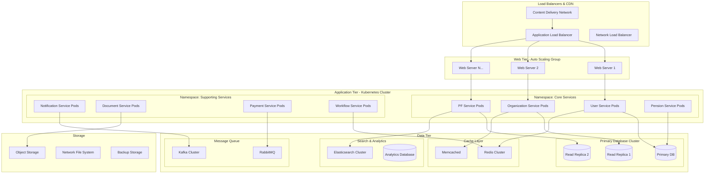

# Deployment and Scalability Strategy

## Infrastructure Architecture Overview



## Containerization Strategy

### 1. Docker Configuration

#### Base Images and Standards
```yaml
Docker_Standards:
  base_images:
    java_applications:
      base: "openjdk:17-jre-slim"
      security_scanning: "enabled"
      vulnerability_threshold: "high"
    
    node_applications:
      base: "node:18-alpine"
      security_scanning: "enabled"
      vulnerability_threshold: "high"
    
    python_applications:
      base: "python:3.11-slim"
      security_scanning: "enabled"
      vulnerability_threshold: "high"
  
  image_optimization:
    multi_stage_builds: "enabled"
    layer_caching: "enabled"
    image_compression: "enabled"
    unused_package_removal: "enabled"
  
  security_practices:
    non_root_user: "required"
    read_only_filesystem: "enabled"
    secret_management: "external_secrets"
    resource_limits: "enforced"

Dockerfile_Example:
  user_service: |
    # Multi-stage build for Java application
    FROM maven:3.8-openjdk-17 AS builder
    WORKDIR /app
    COPY pom.xml .
    RUN mvn dependency:go-offline
    COPY src ./src
    RUN mvn clean package -DskipTests
    
    FROM openjdk:17-jre-slim
    RUN groupadd -r appuser && useradd -r -g appuser appuser
    WORKDIR /app
    COPY --from=builder /app/target/user-service.jar app.jar
    RUN chown -R appuser:appuser /app
    USER appuser
    EXPOSE 8080
    HEALTHCHECK --interval=30s --timeout=3s --start-period=5s --retries=3 \
      CMD curl -f http://localhost:8080/health || exit 1
    ENTRYPOINT ["java", "-jar", "app.jar"]
```

### 2. Kubernetes Deployment

#### Cluster Architecture
```yaml
Kubernetes_Cluster:
  cluster_configuration:
    kubernetes_version: "1.28"
    node_pools:
      system_pool:
        node_count: 3
        instance_type: "Standard_D4s_v3"
        disk_size: "100GB"
        purpose: "System components"
      
      application_pool:
        min_nodes: 5
        max_nodes: 50
        instance_type: "Standard_D8s_v3"
        disk_size: "200GB"
        auto_scaling: "enabled"
        purpose: "Application workloads"
      
      memory_intensive_pool:
        min_nodes: 2
        max_nodes: 10
        instance_type: "Standard_E16s_v3"
        disk_size: "500GB"
        purpose: "Database and cache workloads"
  
  networking:
    cni: "Azure CNI / AWS VPC CNI"
    network_policy: "Calico"
    ingress_controller: "NGINX Ingress"
    service_mesh: "Istio"
    dns: "CoreDNS"
  
  storage:
    storage_classes:
      - name: "fast-ssd"
        provisioner: "kubernetes.io/azure-disk"
        parameters:
          storageaccounttype: "Premium_LRS"
          kind: "Managed"
      
      - name: "standard-hdd"
        provisioner: "kubernetes.io/azure-disk"
        parameters:
          storageaccounttype: "Standard_LRS"
          kind: "Managed"

Namespace_Strategy:
  namespaces:
    - name: "epfo-core"
      purpose: "Core business services"
      resource_quota:
        cpu: "20 cores"
        memory: "40Gi"
        storage: "200Gi"
    
    - name: "epfo-support"
      purpose: "Supporting services"
      resource_quota:
        cpu: "10 cores"
        memory: "20Gi"
        storage: "100Gi"
    
    - name: "epfo-data"
      purpose: "Data services"
      resource_quota:
        cpu: "15 cores"
        memory: "60Gi"
        storage: "500Gi"
    
    - name: "epfo-monitoring"
      purpose: "Monitoring and logging"
      resource_quota:
        cpu: "5 cores"
        memory: "10Gi"
        storage: "100Gi"
```

#### Service Deployment Configuration
```yaml
User_Service_Deployment:
  apiVersion: "apps/v1"
  kind: "Deployment"
  metadata:
    name: "user-service"
    namespace: "epfo-core"
    labels:
      app: "user-service"
      version: "v1.0.0"
  spec:
    replicas: 3
    strategy:
      type: "RollingUpdate"
      rollingUpdate:
        maxSurge: 1
        maxUnavailable: 0
    selector:
      matchLabels:
        app: "user-service"
    template:
      metadata:
        labels:
          app: "user-service"
          version: "v1.0.0"
      spec:
        containers:
        - name: "user-service"
          image: "epfo-registry/user-service:v1.0.0"
          ports:
          - containerPort: 8080
            name: "http"
          env:
          - name: "SPRING_PROFILES_ACTIVE"
            value: "production"
          - name: "DATABASE_URL"
            valueFrom:
              secretKeyRef:
                name: "database-secret"
                key: "url"
          resources:
            requests:
              cpu: "500m"
              memory: "1Gi"
            limits:
              cpu: "2000m"
              memory: "4Gi"
          livenessProbe:
            httpGet:
              path: "/health"
              port: 8080
            initialDelaySeconds: 30
            periodSeconds: 10
          readinessProbe:
            httpGet:
              path: "/ready"
              port: 8080
            initialDelaySeconds: 5
            periodSeconds: 5
          securityContext:
            runAsNonRoot: true
            runAsUser: 1000
            readOnlyRootFilesystem: true
```

## Auto-Scaling Configuration

### 1. Horizontal Pod Autoscaler (HPA)

#### HPA Configuration
```yaml
HPA_Configuration:
  user_service_hpa:
    apiVersion: "autoscaling/v2"
    kind: "HorizontalPodAutoscaler"
    metadata:
      name: "user-service-hpa"
      namespace: "epfo-core"
    spec:
      scaleTargetRef:
        apiVersion: "apps/v1"
        kind: "Deployment"
        name: "user-service"
      minReplicas: 3
      maxReplicas: 20
      metrics:
      - type: "Resource"
        resource:
          name: "cpu"
          target:
            type: "Utilization"
            averageUtilization: 70
      - type: "Resource"
        resource:
          name: "memory"
          target:
            type: "Utilization"
            averageUtilization: 80
      - type: "Pods"
        pods:
          metric:
            name: "http_requests_per_second"
          target:
            type: "AverageValue"
            averageValue: "100"
      behavior:
        scaleUp:
          stabilizationWindowSeconds: 60
          policies:
          - type: "Percent"
            value: 100
            periodSeconds: 15
        scaleDown:
          stabilizationWindowSeconds: 300
          policies:
          - type: "Percent"
            value: 10
            periodSeconds: 60

Custom_Metrics:
  prometheus_adapter:
    custom_metrics:
      - name: "http_requests_per_second"
        query: "sum(rate(http_requests_total[1m])) by (pod)"
      - name: "database_connections"
        query: "sum(database_connections_active) by (pod)"
      - name: "queue_depth"
        query: "sum(queue_messages_pending) by (pod)"
```

### 2. Vertical Pod Autoscaler (VPA)

#### VPA Configuration
```yaml
VPA_Configuration:
  user_service_vpa:
    apiVersion: "autoscaling.k8s.io/v1"
    kind: "VerticalPodAutoscaler"
    metadata:
      name: "user-service-vpa"
      namespace: "epfo-core"
    spec:
      targetRef:
        apiVersion: "apps/v1"
        kind: "Deployment"
        name: "user-service"
      updatePolicy:
        updateMode: "Auto"
      resourcePolicy:
        containerPolicies:
        - containerName: "user-service"
          minAllowed:
            cpu: "100m"
            memory: "128Mi"
          maxAllowed:
            cpu: "4000m"
            memory: "8Gi"
          controlledResources: ["cpu", "memory"]
```

### 3. Cluster Autoscaler

#### Node Auto-Scaling
```yaml
Cluster_Autoscaler:
  configuration:
    min_nodes: 5
    max_nodes: 100
    scale_down_delay_after_add: "10m"
    scale_down_unneeded_time: "10m"
    scale_down_utilization_threshold: 0.5
    skip_nodes_with_local_storage: false
    skip_nodes_with_system_pods: false
  
  node_groups:
    general_purpose:
      min_size: 3
      max_size: 50
      instance_types: ["Standard_D4s_v3", "Standard_D8s_v3"]
      spot_instances: true
      spot_percentage: 30
    
    memory_optimized:
      min_size: 2
      max_size: 20
      instance_types: ["Standard_E8s_v3", "Standard_E16s_v3"]
      spot_instances: false
    
    compute_optimized:
      min_size: 1
      max_size: 10
      instance_types: ["Standard_F8s_v2", "Standard_F16s_v2"]
      spot_instances: true
      spot_percentage: 50
```

## Database Scaling Strategy

### 1. Database Architecture

#### Multi-Master Database Setup
```yaml
Database_Scaling:
  primary_database:
    engine: "PostgreSQL 15"
    instance_type: "db.r6g.2xlarge"
    storage: "1TB SSD"
    backup_retention: "30 days"
    multi_az: true
    encryption: "enabled"
  
  read_replicas:
    replica_1:
      region: "primary"
      instance_type: "db.r6g.xlarge"
      purpose: "read_queries"
      lag_threshold: "1 second"
    
    replica_2:
      region: "primary"
      instance_type: "db.r6g.xlarge"
      purpose: "reporting_queries"
      lag_threshold: "5 seconds"
    
    replica_3:
      region: "secondary"
      instance_type: "db.r6g.large"
      purpose: "disaster_recovery"
      lag_threshold: "10 seconds"
  
  connection_pooling:
    tool: "PgBouncer"
    max_connections: 1000
    pool_mode: "transaction"
    default_pool_size: 100
    reserve_pool_size: 20
  
  sharding_strategy:
    shard_key: "organization_id"
    shard_count: 16
    rebalancing: "automatic"
    cross_shard_queries: "supported"
```

### 2. Caching Strategy

#### Multi-Level Caching
```yaml
Caching_Architecture:
  application_cache:
    technology: "Redis Cluster"
    nodes: 6
    memory_per_node: "16GB"
    replication_factor: 2
    persistence: "RDB + AOF"
    eviction_policy: "allkeys-lru"
  
  database_cache:
    technology: "Memcached"
    nodes: 4
    memory_per_node: "8GB"
    purpose: "Query result caching"
    ttl: "1 hour"
  
  cdn_cache:
    technology: "CloudFlare / AWS CloudFront"
    edge_locations: "global"
    static_content_ttl: "24 hours"
    dynamic_content_ttl: "5 minutes"
    cache_behaviors:
      - path: "/api/*"
        ttl: "0"
        cache_policy: "no-cache"
      - path: "/static/*"
        ttl: "86400"
        cache_policy: "cache-first"
  
  cache_invalidation:
    strategy: "event_driven"
    tools: ["Redis Pub/Sub", "Kafka"]
    patterns:
      - write_through: "Update cache on write"
      - write_behind: "Async cache update"
      - cache_aside: "Load on cache miss"
```

## Load Balancing and Traffic Management

### 1. Load Balancer Configuration

#### Multi-Tier Load Balancing
```yaml
Load_Balancing:
  global_load_balancer:
    technology: "AWS Global Accelerator / Azure Traffic Manager"
    routing_policy: "performance"
    health_checks: "enabled"
    failover_time: "< 30 seconds"
  
  regional_load_balancer:
    technology: "Application Load Balancer"
    algorithm: "round_robin"
    sticky_sessions: "enabled"
    ssl_termination: "enabled"
    waf_integration: "enabled"
  
  service_mesh:
    technology: "Istio"
    features:
      - traffic_splitting: "A/B testing"
      - circuit_breaker: "Fault tolerance"
      - retry_policy: "Automatic retries"
      - timeout_policy: "Request timeouts"
      - rate_limiting: "Request throttling"
  
  health_checks:
    endpoint: "/health"
    interval: "30 seconds"
    timeout: "5 seconds"
    healthy_threshold: 2
    unhealthy_threshold: 3
    failure_actions:
      - remove_from_pool: "immediate"
      - alert_operations: "immediate"
      - auto_recovery: "enabled"
```

### 2. Traffic Routing

#### Intelligent Traffic Management
```yaml
Traffic_Management:
  routing_rules:
    geographic_routing:
      - region: "north_india"
        datacenter: "delhi"
        latency_threshold: "50ms"
      - region: "south_india"
        datacenter: "bangalore"
        latency_threshold: "50ms"
      - region: "west_india"
        datacenter: "mumbai"
        latency_threshold: "50ms"
  
  canary_deployment:
    strategy: "percentage_based"
    initial_percentage: 5
    increment_percentage: 10
    increment_interval: "30 minutes"
    success_criteria:
      - error_rate: "< 1%"
      - response_time: "< 2 seconds"
      - user_satisfaction: "> 95%"
  
  blue_green_deployment:
    switch_strategy: "dns_based"
    rollback_time: "< 5 minutes"
    validation_tests:
      - smoke_tests: "automated"
      - integration_tests: "automated"
      - user_acceptance_tests: "manual"
```

## Monitoring and Observability

### 1. Monitoring Stack

#### Comprehensive Monitoring
```yaml
Monitoring_Stack:
  metrics:
    technology: "Prometheus + Grafana"
    retention: "90 days"
    scrape_interval: "15 seconds"
    alerting: "AlertManager"
    
    dashboards:
      - infrastructure: "Node metrics, resource usage"
      - application: "Service metrics, business KPIs"
      - database: "Query performance, connection pools"
      - user_experience: "Response times, error rates"
  
  logging:
    technology: "ELK Stack (Elasticsearch, Logstash, Kibana)"
    log_retention: "30 days"
    log_levels: ["ERROR", "WARN", "INFO", "DEBUG"]
    structured_logging: "JSON format"
    
    log_aggregation:
      - application_logs: "Centralized collection"
      - system_logs: "OS and infrastructure logs"
      - audit_logs: "Security and compliance logs"
      - access_logs: "HTTP request logs"
  
  tracing:
    technology: "Jaeger"
    sampling_rate: "1%"
    trace_retention: "7 days"
    correlation_ids: "enabled"
    
    trace_analysis:
      - performance_bottlenecks: "Slow operations"
      - error_tracking: "Failed requests"
      - dependency_mapping: "Service interactions"
```

### 2. Alerting Strategy

#### Proactive Alerting
```yaml
Alerting_Configuration:
  alert_categories:
    critical:
      - service_down: "Service unavailable"
      - high_error_rate: "Error rate > 5%"
      - database_connection_failure: "DB connectivity issues"
      - security_breach: "Security incidents"
      response_time: "immediate"
      escalation: "on-call engineer"
    
    warning:
      - high_cpu_usage: "CPU > 80%"
      - high_memory_usage: "Memory > 85%"
      - slow_response_time: "Response time > 2s"
      - queue_backup: "Message queue depth > 1000"
      response_time: "15 minutes"
      escalation: "team lead"
    
    info:
      - deployment_completed: "Successful deployment"
      - scaling_event: "Auto-scaling triggered"
      - backup_completed: "Backup successful"
      response_time: "1 hour"
      escalation: "team notification"
  
  notification_channels:
    - pagerduty: "Critical alerts"
    - slack: "Warning and info alerts"
    - email: "Daily summaries"
    - sms: "Critical alerts only"
```

## Disaster Recovery and Business Continuity

### 1. Backup Strategy

#### Comprehensive Backup Plan
```yaml
Backup_Strategy:
  database_backups:
    full_backup:
      frequency: "daily"
      retention: "30 days"
      storage: "encrypted_s3"
      verification: "automated"
    
    incremental_backup:
      frequency: "every_4_hours"
      retention: "7 days"
      storage: "encrypted_s3"
      verification: "automated"
    
    point_in_time_recovery:
      enabled: true
      retention: "7 days"
      granularity: "1 second"
  
  application_backups:
    configuration_backup:
      frequency: "on_change"
      retention: "90 days"
      storage: "version_control"
    
    file_system_backup:
      frequency: "daily"
      retention: "30 days"
      storage: "encrypted_storage"
      compression: "enabled"
  
  backup_testing:
    frequency: "monthly"
    test_types:
      - restore_test: "Full system restore"
      - data_integrity: "Data validation"
      - performance_test: "Restore time measurement"
```

### 2. Multi-Region Deployment

#### Geographic Distribution
```yaml
Multi_Region_Strategy:
  primary_region:
    location: "Mumbai (West India)"
    capacity: "100% production load"
    services: "all_services"
    database: "primary_with_replicas"
  
  secondary_region:
    location: "Delhi (North India)"
    capacity: "100% production load"
    services: "all_services"
    database: "read_replicas"
    failover_time: "< 5 minutes"
  
  tertiary_region:
    location: "Bangalore (South India)"
    capacity: "50% production load"
    services: "core_services_only"
    database: "backup_replicas"
    failover_time: "< 30 minutes"
  
  data_synchronization:
    method: "asynchronous_replication"
    lag_tolerance: "< 1 minute"
    conflict_resolution: "last_write_wins"
    monitoring: "continuous"
```

This comprehensive deployment and scalability strategy ensures that the EPFO portal can handle massive scale while maintaining high availability, performance, and reliability.