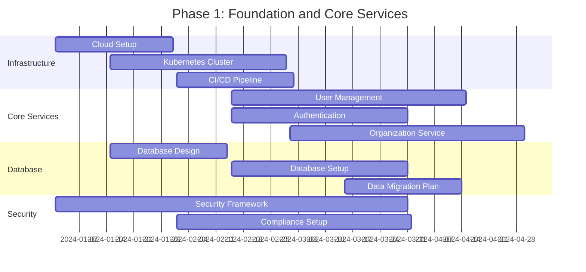
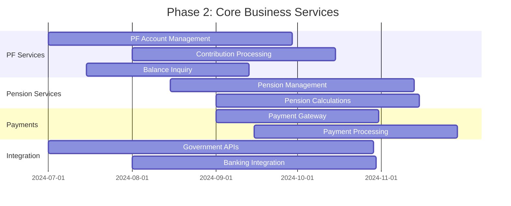
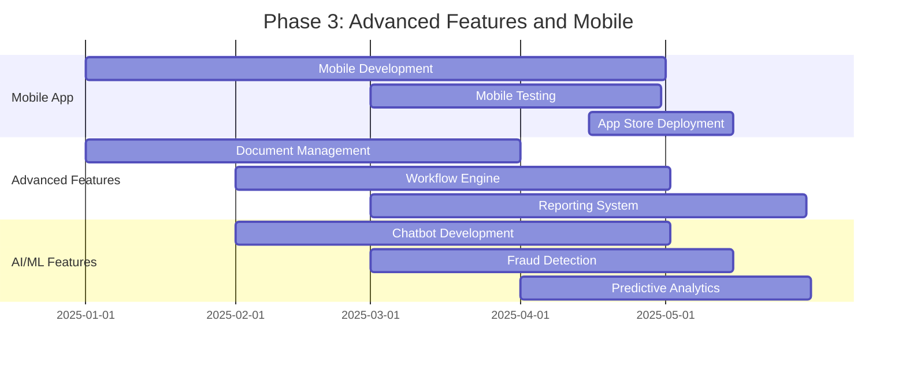
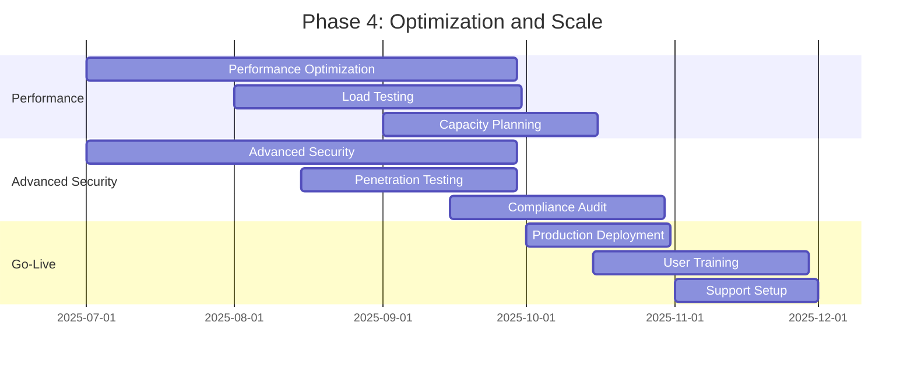

# Implementation Roadmap and Recommendations

## Executive Summary

This document provides a comprehensive implementation roadmap for developing a modern, multi-tenant EPFO portal that addresses current pain points while ensuring scalability, security, and compliance with government standards.

### Key Recommendations
1. **Phased Implementation Approach**: Implement in 4 phases over 18-24 months
2. **Technology Stack**: Modern cloud-native architecture with microservices
3. **Multi-Tenant Strategy**: Hybrid approach with shared infrastructure and tenant isolation
4. **Security First**: Implement security by design with comprehensive compliance framework
5. **User-Centric Design**: Focus on user experience improvements and mobile-first approach

## Implementation Phases

### Phase 1: Foundation and Core Services (Months 1-6)



#### Phase 1 Deliverables
```yaml
Infrastructure_Setup:
  deliverables:
    - cloud_environment: "Multi-region cloud setup"
    - kubernetes_cluster: "Production-ready K8s cluster"
    - monitoring_stack: "Prometheus, Grafana, ELK stack"
    - ci_cd_pipeline: "Automated build and deployment"
    - security_baseline: "Security controls and policies"
  
  success_criteria:
    - infrastructure_availability: "> 99.9%"
    - deployment_automation: "100% automated"
    - security_compliance: "All controls implemented"
    - monitoring_coverage: "100% service coverage"

Core_Services:
  deliverables:
    - user_management_api: "Complete user lifecycle management"
    - authentication_service: "Multi-factor authentication"
    - organization_service: "Multi-tenant organization management"
    - basic_web_portal: "Minimal viable portal"
  
  success_criteria:
    - api_response_time: "< 500ms"
    - authentication_success_rate: "> 99.5%"
    - user_registration_flow: "Fully functional"
    - organization_onboarding: "Automated process"

Database_Foundation:
  deliverables:
    - database_schema: "Complete data model"
    - master_data_setup: "Reference data loaded"
    - backup_strategy: "Automated backup system"
    - data_migration_tools: "Legacy data migration"
  
  success_criteria:
    - database_performance: "< 100ms query response"
    - backup_reliability: "100% successful backups"
    - data_integrity: "Zero data corruption"
    - migration_accuracy: "99.99% data accuracy"
```

### Phase 2: Core Business Services (Months 7-12)



#### Phase 2 Deliverables
```yaml
PF_Services:
  deliverables:
    - pf_account_service: "Complete PF account management"
    - contribution_service: "Monthly contribution processing"
    - balance_inquiry_api: "Real-time balance queries"
    - withdrawal_service: "PF withdrawal processing"
    - transfer_service: "PF transfer between establishments"
  
  success_criteria:
    - balance_accuracy: "100% accurate calculations"
    - contribution_processing: "Real-time processing"
    - withdrawal_processing_time: "< 7 days average"
    - transfer_success_rate: "> 95%"

Pension_Services:
  deliverables:
    - pension_account_service: "EPS account management"
    - pension_calculation_engine: "Automated pension calculations"
    - pension_disbursement: "Monthly pension payments"
    - life_certificate_service: "Digital life certificate"
  
  success_criteria:
    - pension_calculation_accuracy: "100% accurate"
    - disbursement_timeliness: "100% on-time payments"
    - life_certificate_adoption: "> 80% digital submission"

Payment_Integration:
  deliverables:
    - payment_gateway_integration: "Multiple payment methods"
    - banking_api_integration: "Real-time payment status"
    - reconciliation_service: "Automated reconciliation"
    - refund_processing: "Automated refund handling"
  
  success_criteria:
    - payment_success_rate: "> 98%"
    - reconciliation_accuracy: "100% automated"
    - refund_processing_time: "< 3 days"

External_Integrations:
  deliverables:
    - aadhaar_integration: "eKYC and authentication"
    - pan_verification: "Real-time PAN validation"
    - bank_account_verification: "Automated verification"
    - gstn_integration: "Business verification"
  
  success_criteria:
    - integration_uptime: "> 99%"
    - verification_accuracy: "> 95%"
    - response_time: "< 5 seconds"
```

### Phase 3: Advanced Features and Mobile (Months 13-18)



#### Phase 3 Deliverables
```yaml
Mobile_Application:
  deliverables:
    - native_mobile_apps: "iOS and Android apps"
    - offline_capabilities: "Core features work offline"
    - push_notifications: "Real-time notifications"
    - biometric_authentication: "Fingerprint/face recognition"
    - mobile_specific_features: "Camera document upload"
  
  success_criteria:
    - app_store_rating: "> 4.0 stars"
    - mobile_adoption: "> 60% of users"
    - crash_rate: "< 1%"
    - performance: "< 3 second load time"

Advanced_Features:
  deliverables:
    - document_management_system: "Digital document handling"
    - workflow_engine: "Configurable business processes"
    - advanced_reporting: "Self-service analytics"
    - bulk_operations: "Mass data processing"
    - api_marketplace: "Third-party integrations"
  
  success_criteria:
    - document_processing_time: "< 24 hours"
    - workflow_automation: "> 80% automated approvals"
    - report_generation_time: "< 30 seconds"
    - bulk_operation_success: "> 95%"

AI_ML_Features:
  deliverables:
    - intelligent_chatbot: "24/7 customer support"
    - fraud_detection_system: "Real-time fraud monitoring"
    - predictive_analytics: "Trend analysis and forecasting"
    - recommendation_engine: "Personalized user experience"
  
  success_criteria:
    - chatbot_resolution_rate: "> 70%"
    - fraud_detection_accuracy: "> 95%"
    - prediction_accuracy: "> 85%"
    - user_satisfaction: "> 90%"
```

### Phase 4: Optimization and Scale (Months 19-24)



#### Phase 4 Deliverables
```yaml
Performance_Optimization:
  deliverables:
    - performance_tuning: "System-wide optimization"
    - caching_strategy: "Multi-level caching implementation"
    - database_optimization: "Query and index optimization"
    - cdn_implementation: "Global content delivery"
  
  success_criteria:
    - page_load_time: "< 2 seconds"
    - api_response_time: "< 200ms"
    - concurrent_users: "Support 100,000+ users"
    - system_availability: "> 99.95%"

Security_Hardening:
  deliverables:
    - security_audit: "Comprehensive security review"
    - penetration_testing: "Third-party security testing"
    - compliance_certification: "Government compliance audit"
    - security_monitoring: "24/7 security operations center"
  
  success_criteria:
    - security_vulnerabilities: "Zero critical vulnerabilities"
    - compliance_score: "100% compliance"
    - incident_response_time: "< 15 minutes"
    - security_training: "100% team trained"

Production_Readiness:
  deliverables:
    - production_deployment: "Full production rollout"
    - user_training_program: "Comprehensive training materials"
    - support_documentation: "Complete user and admin guides"
    - monitoring_dashboards: "Real-time system monitoring"
  
  success_criteria:
    - deployment_success: "Zero-downtime deployment"
    - user_adoption: "> 80% within 3 months"
    - support_ticket_resolution: "< 24 hours average"
    - system_stability: "99.9% uptime"
```

## Technology Stack Recommendations

### 1. Frontend Technologies

#### Web Application Stack
```yaml
Frontend_Stack:
  framework: "React 18 with TypeScript"
  state_management: "Redux Toolkit"
  ui_library: "Material-UI / Ant Design"
  build_tool: "Vite"
  testing: "Jest + React Testing Library"
  
  key_features:
    - responsive_design: "Mobile-first approach"
    - progressive_web_app: "Offline capabilities"
    - accessibility: "WCAG 2.1 AA compliance"
    - internationalization: "Multi-language support"
    - performance: "Code splitting and lazy loading"
  
  browser_support:
    - chrome: "Latest 2 versions"
    - firefox: "Latest 2 versions"
    - safari: "Latest 2 versions"
    - edge: "Latest 2 versions"
    - mobile_browsers: "iOS Safari, Chrome Mobile"
```

#### Mobile Application Stack
```yaml
Mobile_Stack:
  approach: "React Native"
  navigation: "React Navigation 6"
  state_management: "Redux Toolkit"
  ui_components: "NativeBase / React Native Elements"
  testing: "Detox + Jest"
  
  platform_support:
    - ios: "iOS 12+"
    - android: "Android 8+ (API 26+)"
  
  key_features:
    - offline_sync: "Background data synchronization"
    - push_notifications: "Firebase Cloud Messaging"
    - biometric_auth: "Touch ID / Face ID / Fingerprint"
    - camera_integration: "Document scanning"
    - deep_linking: "Universal links support"
```

### 2. Backend Technologies

#### Microservices Stack
```yaml
Backend_Stack:
  primary_language: "Java 17 with Spring Boot 3"
  alternative_language: "Node.js 18 with Express"
  api_gateway: "Spring Cloud Gateway / Kong"
  service_discovery: "Consul / Eureka"
  configuration_management: "Spring Cloud Config"
  
  frameworks_and_libraries:
    - spring_boot: "3.1.x"
    - spring_security: "OAuth 2.0 + JWT"
    - spring_data_jpa: "Database abstraction"
    - spring_cloud: "Microservices utilities"
    - hibernate: "ORM framework"
    - jackson: "JSON processing"
  
  testing_stack:
    - junit5: "Unit testing"
    - testcontainers: "Integration testing"
    - wiremock: "API mocking"
    - spring_boot_test: "Spring-specific testing"
```

### 3. Database and Storage

#### Database Strategy
```yaml
Database_Stack:
  primary_database: "PostgreSQL 15"
  cache_database: "Redis 7"
  search_engine: "Elasticsearch 8"
  message_queue: "Apache Kafka"
  object_storage: "AWS S3 / Azure Blob Storage"
  
  database_features:
    - connection_pooling: "HikariCP"
    - migration_tool: "Flyway"
    - monitoring: "pg_stat_statements"
    - backup_tool: "pg_dump + WAL-E"
    - replication: "Streaming replication"
  
  performance_optimization:
    - indexing_strategy: "Composite and partial indexes"
    - query_optimization: "Query plan analysis"
    - partitioning: "Time-based partitioning"
    - archiving: "Automated data archiving"
```

### 4. DevOps and Infrastructure

#### Infrastructure Stack
```yaml
Infrastructure_Stack:
  cloud_provider: "AWS / Azure (Multi-cloud)"
  container_platform: "Kubernetes 1.28"
  container_runtime: "Docker"
  service_mesh: "Istio"
  ingress_controller: "NGINX Ingress"
  
  ci_cd_pipeline:
    - version_control: "Git (GitLab/GitHub)"
    - ci_cd_tool: "GitLab CI / GitHub Actions"
    - artifact_registry: "Docker Registry"
    - deployment_tool: "Helm Charts"
    - testing_automation: "Automated test suites"
  
  monitoring_stack:
    - metrics: "Prometheus + Grafana"
    - logging: "ELK Stack (Elasticsearch, Logstash, Kibana)"
    - tracing: "Jaeger"
    - alerting: "AlertManager + PagerDuty"
    - uptime_monitoring: "Pingdom / StatusPage"
```

## Risk Assessment and Mitigation

### 1. Technical Risks

#### High-Priority Risks
```yaml
Technical_Risks:
  scalability_challenges:
    risk_level: "High"
    description: "System may not handle expected load"
    probability: "Medium"
    impact: "High"
    mitigation_strategies:
      - load_testing: "Comprehensive performance testing"
      - auto_scaling: "Horizontal and vertical scaling"
      - caching_strategy: "Multi-level caching"
      - database_optimization: "Query and schema optimization"
    
  integration_complexity:
    risk_level: "High"
    description: "Complex integrations with government systems"
    probability: "High"
    impact: "Medium"
    mitigation_strategies:
      - early_integration_testing: "Start integration early"
      - fallback_mechanisms: "Manual processes as backup"
      - api_versioning: "Backward compatibility"
      - monitoring: "Real-time integration monitoring"
  
  security_vulnerabilities:
    risk_level: "Critical"
    description: "Security breaches or data leaks"
    probability: "Low"
    impact: "Critical"
    mitigation_strategies:
      - security_by_design: "Built-in security controls"
      - regular_audits: "Quarterly security audits"
      - penetration_testing: "Annual pen testing"
      - incident_response: "24/7 security monitoring"
```

### 2. Business Risks

#### Business Risk Matrix
```yaml
Business_Risks:
  user_adoption:
    risk_level: "Medium"
    description: "Low user adoption of new system"
    probability: "Medium"
    impact: "High"
    mitigation_strategies:
      - user_training: "Comprehensive training program"
      - change_management: "Structured change process"
      - feedback_loops: "Continuous user feedback"
      - gradual_rollout: "Phased deployment approach"
  
  regulatory_compliance:
    risk_level: "High"
    description: "Non-compliance with government regulations"
    probability: "Low"
    impact: "Critical"
    mitigation_strategies:
      - compliance_framework: "Built-in compliance controls"
      - regular_audits: "Quarterly compliance reviews"
      - legal_consultation: "Regular legal reviews"
      - documentation: "Comprehensive audit trails"
  
  budget_overrun:
    risk_level: "Medium"
    description: "Project exceeds allocated budget"
    probability: "Medium"
    impact: "Medium"
    mitigation_strategies:
      - detailed_estimation: "Comprehensive cost estimation"
      - regular_monitoring: "Monthly budget reviews"
      - scope_management: "Strict scope control"
      - contingency_planning: "15% budget contingency"
```

## Success Metrics and KPIs

### 1. Technical KPIs

#### Performance Metrics
```yaml
Technical_KPIs:
  performance_metrics:
    - page_load_time: "< 2 seconds (95th percentile)"
    - api_response_time: "< 200ms (average)"
    - system_availability: "> 99.9% uptime"
    - concurrent_users: "Support 100,000+ concurrent users"
    - database_query_time: "< 100ms (average)"
  
  scalability_metrics:
    - auto_scaling_efficiency: "> 95% successful scaling events"
    - resource_utilization: "70-80% optimal utilization"
    - load_balancing: "Even distribution across instances"
    - cache_hit_ratio: "> 90% cache effectiveness"
  
  security_metrics:
    - security_incidents: "Zero critical security incidents"
    - vulnerability_resolution: "< 24 hours for critical"
    - compliance_score: "100% regulatory compliance"
    - authentication_success: "> 99.5% success rate"
```

### 2. Business KPIs

#### User Experience Metrics
```yaml
Business_KPIs:
  user_experience:
    - user_satisfaction: "> 90% satisfaction score"
    - task_completion_rate: "> 95% successful completions"
    - user_adoption: "> 80% active users within 6 months"
    - mobile_adoption: "> 60% mobile usage"
    - support_ticket_reduction: "50% reduction in support tickets"
  
  operational_efficiency:
    - processing_time_reduction: "70% faster processing"
    - automation_rate: "> 80% automated processes"
    - error_rate_reduction: "90% reduction in manual errors"
    - cost_per_transaction: "50% reduction in processing costs"
  
  business_impact:
    - digital_adoption: "> 90% digital transactions"
    - paper_reduction: "80% reduction in paper usage"
    - compliance_improvement: "100% regulatory compliance"
    - citizen_satisfaction: "> 85% citizen satisfaction"
```

## Budget Estimation

### 1. Development Costs

#### Phase-wise Budget Breakdown
```yaml
Budget_Estimation:
  phase_1_foundation:
    duration: "6 months"
    team_size: "25 people"
    estimated_cost: "₹3.5 crores"
    breakdown:
      - development_team: "₹2.0 crores"
      - infrastructure: "₹0.8 crores"
      - third_party_licenses: "₹0.4 crores"
      - security_audit: "₹0.3 crores"
  
  phase_2_core_services:
    duration: "6 months"
    team_size: "35 people"
    estimated_cost: "₹5.2 crores"
    breakdown:
      - development_team: "₹3.5 crores"
      - integration_costs: "₹0.8 crores"
      - testing_qa: "₹0.5 crores"
      - infrastructure_scaling: "₹0.4 crores"
  
  phase_3_advanced_features:
    duration: "6 months"
    team_size: "30 people"
    estimated_cost: "₹4.8 crores"
    breakdown:
      - development_team: "₹3.0 crores"
      - mobile_development: "₹1.0 crores"
      - ai_ml_development: "₹0.5 crores"
      - advanced_testing: "₹0.3 crores"
  
  phase_4_optimization:
    duration: "6 months"
    team_size: "20 people"
    estimated_cost: "₹3.0 crores"
    breakdown:
      - optimization_team: "₹1.5 crores"
      - security_hardening: "₹0.5 crores"
      - training_documentation: "₹0.5 crores"
      - go_live_support: "₹0.5 crores"
  
  total_project_cost: "₹16.5 crores"
  contingency_15_percent: "₹2.5 crores"
  grand_total: "₹19.0 crores"
```

### 2. Operational Costs (Annual)

#### Ongoing Operational Expenses
```yaml
Operational_Costs:
  infrastructure_costs:
    - cloud_hosting: "₹1.2 crores/year"
    - cdn_services: "₹0.3 crores/year"
    - monitoring_tools: "₹0.2 crores/year"
    - backup_storage: "₹0.1 crores/year"
    - security_services: "₹0.4 crores/year"
  
  support_and_maintenance:
    - development_team: "₹2.5 crores/year"
    - operations_team: "₹1.0 crores/year"
    - security_team: "₹0.8 crores/year"
    - third_party_support: "₹0.5 crores/year"
  
  licensing_and_subscriptions:
    - software_licenses: "₹0.6 crores/year"
    - third_party_apis: "₹0.4 crores/year"
    - monitoring_tools: "₹0.2 crores/year"
    - security_tools: "₹0.3 crores/year"
  
  total_annual_operational_cost: "₹8.5 crores/year"
```

## Conclusion and Next Steps

### Key Success Factors
1. **Strong Leadership**: Dedicated project leadership with clear accountability
2. **User-Centric Approach**: Continuous user feedback and iterative improvements
3. **Agile Methodology**: Flexible development approach with regular deliveries
4. **Quality Assurance**: Comprehensive testing at every phase
5. **Change Management**: Structured approach to organizational change

### Immediate Next Steps
1. **Stakeholder Approval**: Get approval for the proposed architecture and roadmap
2. **Team Formation**: Assemble the core project team and define roles
3. **Vendor Selection**: Select technology partners and cloud providers
4. **Detailed Planning**: Create detailed project plans for Phase 1
5. **Risk Management**: Establish risk monitoring and mitigation processes

### Long-term Vision
The new EPFO portal will serve as a model for digital government services, providing:
- **Seamless User Experience**: Intuitive, mobile-first design
- **Operational Efficiency**: Automated processes and reduced manual work
- **Scalable Architecture**: Support for millions of users and organizations
- **Security and Compliance**: Best-in-class security with full regulatory compliance
- **Innovation Platform**: Foundation for future AI/ML and advanced features

This comprehensive design and implementation plan provides a solid foundation for creating a world-class EPFO portal that will serve Indian citizens and organizations effectively for years to come.