# Integration Requirements with External Systems

## Integration Architecture Overview

```mermaid
graph TB
    subgraph "EPFO Portal Core"
        CORE[Core Application]
        API_GW[API Gateway]
        ESB[Enterprise Service Bus]
        QUEUE[Message Queue]
    end
    
    subgraph "Government Systems"
        AADHAAR[UIDAI - Aadhaar]
        PAN[Income Tax - PAN]
        GSTN[GSTN Portal]
        DIGI_LOCKER[DigiLocker]
        UMANG[UMANG Platform]
    end
    
    subgraph "Banking Systems"
        NPCI[NPCI - UPI/IMPS]
        NEFT[NEFT/RTGS]
        BANK_API[Bank APIs]
        PAYMENT_GW[Payment Gateways]
    end
    
    subgraph "Third Party Services"
        SMS_GW[SMS Gateway]
        EMAIL[Email Service]
        ESIGN[eSign Service]
        KYC[KYC Providers]
        CREDIT[Credit Bureaus]
    end
    
    subgraph "Organization Systems"
        PAYROLL[Payroll Systems]
        HRMS[HRMS Systems]
        ERP[ERP Systems]
        AD[Active Directory]
    end
    
    subgraph "Compliance & Audit"
        MCA[MCA Portal]
        SEBI[SEBI Systems]
        AUDIT[Audit Systems]
        REPORTING[Regulatory Reporting]
    end
    
    CORE --> API_GW
    API_GW --> ESB
    ESB --> QUEUE
    
    ESB --> AADHAAR
    ESB --> PAN
    ESB --> GSTN
    ESB --> DIGI_LOCKER
    ESB --> UMANG
    
    ESB --> NPCI
    ESB --> NEFT
    ESB --> BANK_API
    ESB --> PAYMENT_GW
    
    ESB --> SMS_GW
    ESB --> EMAIL
    ESB --> ESIGN
    ESB --> KYC
    ESB --> CREDIT
    
    ESB --> PAYROLL
    ESB --> HRMS
    ESB --> ERP
    ESB --> AD
    
    ESB --> MCA
    ESB --> SEBI
    ESB --> AUDIT
    ESB --> REPORTING
```



## Government System Integrations

### 1. UIDAI (Aadhaar) Integration

#### Authentication Services
```yaml
Aadhaar_Authentication:
  service_type: "Authentication API"
  endpoint: "https://auth.uidai.gov.in/auth/2.5/"
  authentication_methods:
    - demographic: "Name, DOB, Gender verification"
    - biometric: "Fingerprint, Iris verification"
    - otp: "OTP-based authentication"
  
  use_cases:
    - user_registration: "Verify identity during signup"
    - kyc_verification: "Complete KYC process"
    - duplicate_check: "Prevent duplicate accounts"
    - profile_update: "Verify before profile changes"
  
  technical_specs:
    protocol: "HTTPS/REST"
    format: "XML/JSON"
    encryption: "2048-bit RSA + AES-256"
    certificate: "Digital signature required"
    rate_limit: "100 requests/minute"
  
  compliance:
    - Aadhaar Act 2016 compliance
    - Purpose limitation
    - Data minimization
    - Consent management
```

#### eKYC Services
```yaml
eKYC_Integration:
  service_type: "eKYC API"
  endpoint: "https://ekyc.uidai.gov.in/ekyc/2.5/"
  
  data_elements:
    - name: "Full name from Aadhaar"
    - dob: "Date of birth"
    - gender: "Gender information"
    - address: "Complete address"
    - photo: "Aadhaar photo (if consented)"
  
  implementation:
    consent_flow: "Explicit user consent required"
    data_retention: "Delete after verification"
    audit_trail: "Complete audit logging"
    error_handling: "Graceful fallback to manual KYC"
```

### 2. Income Tax Department Integration

#### PAN Verification
```yaml
PAN_Verification:
  service_type: "PAN Verification API"
  endpoint: "https://www.incometaxindiaefiling.gov.in/e-Filing/Services/"
  
  verification_types:
    - pan_validation: "Check PAN format and validity"
    - name_matching: "Match name with PAN database"
    - status_check: "Check if PAN is active/cancelled"
  
  use_cases:
    - employer_registration: "Verify organization PAN"
    - employee_onboarding: "Verify employee PAN"
    - tax_compliance: "TDS and tax reporting"
    - duplicate_prevention: "Prevent multiple accounts"
  
  technical_specs:
    protocol: "SOAP/REST"
    authentication: "Digital certificate"
    rate_limit: "50 requests/minute"
    response_time: "< 5 seconds"
```

### 3. GSTN Integration

#### GST Verification
```yaml
GSTN_Integration:
  service_type: "GST Verification API"
  endpoint: "https://api.gst.gov.in/"
  
  services:
    - gstin_verification: "Verify GSTIN validity"
    - business_details: "Get business information"
    - filing_status: "Check GST filing status"
    - compliance_check: "Verify GST compliance"
  
  use_cases:
    - organization_verification: "Verify business legitimacy"
    - compliance_monitoring: "Track GST compliance"
    - risk_assessment: "Assess organization risk"
```

### 4. DigiLocker Integration

#### Document Services
```yaml
DigiLocker_Integration:
  service_type: "Document API"
  endpoint: "https://api.digilocker.gov.in/"
  
  services:
    - document_fetch: "Retrieve documents from DigiLocker"
    - document_verify: "Verify document authenticity"
    - document_share: "Share documents securely"
  
  supported_documents:
    - aadhaar_card: "Aadhaar card"
    - pan_card: "PAN card"
    - driving_license: "Driving license"
    - passport: "Passport"
    - educational_certificates: "Educational documents"
  
  implementation:
    oauth_flow: "OAuth 2.0 authorization"
    consent_management: "User consent required"
    document_validation: "Digital signature verification"
```

## Banking and Payment Integrations

### 1. NPCI Integration

#### UPI Services
```yaml
UPI_Integration:
  service_type: "UPI Payment API"
  endpoint: "https://api.npci.org.in/upi/"
  
  services:
    - payment_initiation: "Initiate UPI payments"
    - payment_status: "Check payment status"
    - refund_processing: "Process refunds"
    - mandate_management: "Manage recurring payments"
  
  use_cases:
    - contribution_payments: "Employee/employer contributions"
    - pension_disbursement: "Pension payments"
    - refund_processing: "Process refunds"
    - fee_collection: "Administrative fees"
  
  technical_specs:
    protocol: "HTTPS/REST"
    authentication: "Digital certificate + API key"
    encryption: "End-to-end encryption"
    rate_limit: "1000 requests/minute"
```

#### IMPS/NEFT Services
```yaml
IMPS_NEFT_Integration:
  service_type: "Fund Transfer API"
  
  imps_services:
    - instant_transfer: "Real-time fund transfer"
    - status_inquiry: "Transaction status check"
    - beneficiary_validation: "Account validation"
  
  neft_services:
    - batch_transfer: "Bulk fund transfers"
    - scheduled_transfer: "Scheduled payments"
    - return_processing: "Handle failed transfers"
  
  use_cases:
    - bulk_pension_payments: "Monthly pension disbursement"
    - withdrawal_processing: "PF withdrawal payments"
    - refund_processing: "Contribution refunds"
```

### 2. Bank API Integration

#### Account Verification
```yaml
Bank_Account_Verification:
  service_type: "Account Verification API"
  
  verification_methods:
    - penny_drop: "Small amount verification"
    - name_matching: "Account holder name verification"
    - ifsc_validation: "IFSC code validation"
    - account_status: "Check account status"
  
  supported_banks:
    - public_sector: "SBI, PNB, BOI, etc."
    - private_sector: "HDFC, ICICI, Axis, etc."
    - cooperative: "Regional cooperative banks"
    - payment_banks: "Paytm, Airtel, etc."
  
  implementation:
    real_time_verification: "Instant verification"
    fallback_mechanism: "Manual verification if API fails"
    audit_logging: "Complete transaction logs"
```

## Third-Party Service Integrations

### 1. Communication Services

#### SMS Gateway Integration
```yaml
SMS_Gateway:
  primary_provider: "NIC SMS Gateway"
  backup_providers: ["Airtel", "Vodafone", "BSNL"]
  
  message_types:
    - otp: "One-time passwords"
    - alerts: "Transaction alerts"
    - notifications: "Status updates"
    - reminders: "Due date reminders"
  
  features:
    - delivery_reports: "Message delivery status"
    - unicode_support: "Regional language support"
    - bulk_messaging: "Mass notifications"
    - scheduling: "Scheduled messages"
  
  technical_specs:
    protocol: "HTTP/HTTPS"
    format: "JSON/XML"
    rate_limit: "10000 messages/minute"
    delivery_time: "< 30 seconds"
```

#### Email Service Integration
```yaml
Email_Service:
  primary_provider: "Government Email Service"
  backup_providers: ["AWS SES", "SendGrid"]
  
  email_types:
    - transactional: "OTP, confirmations"
    - notifications: "Status updates"
    - reports: "Monthly statements"
    - alerts: "Security alerts"
  
  features:
    - template_engine: "Dynamic email templates"
    - attachment_support: "PDF attachments"
    - tracking: "Open and click tracking"
    - bounce_handling: "Handle bounced emails"
  
  security:
    - dkim_signing: "Email authentication"
    - spf_records: "Sender verification"
    - encryption: "TLS encryption"
    - anti_spam: "Spam prevention"
```

### 2. Digital Signature Integration

#### eSign Services
```yaml
eSign_Integration:
  service_provider: "NIC eSign Service"
  endpoint: "https://esign.gov.in/esignlevel1"
  
  signature_types:
    - aadhaar_esign: "Aadhaar-based eSign"
    - dsc_esign: "Digital signature certificate"
    - otp_esign: "OTP-based signing"
  
  use_cases:
    - application_signing: "Sign withdrawal applications"
    - document_approval: "Approve official documents"
    - agreement_signing: "Sign service agreements"
    - certificate_issuance: "Issue signed certificates"
  
  technical_specs:
    protocol: "HTTPS/REST"
    format: "PDF/XML"
    certificate_standard: "X.509"
    hash_algorithm: "SHA-256"
```

### 3. KYC and Verification Services

#### KYC Provider Integration
```yaml
KYC_Services:
  providers:
    - karza: "Document verification"
    - signzy: "Video KYC"
    - bureau_id: "Identity verification"
  
  verification_types:
    - document_ocr: "Extract data from documents"
    - face_matching: "Match photo with document"
    - liveness_check: "Verify live person"
    - address_verification: "Verify address"
  
  documents_supported:
    - aadhaar: "Aadhaar card verification"
    - pan: "PAN card verification"
    - passport: "Passport verification"
    - driving_license: "DL verification"
    - voter_id: "Voter ID verification"
```

## Organization System Integrations

### 1. Payroll System Integration

#### Common Payroll Systems
```yaml
Payroll_Integrations:
  sap_successfactors:
    integration_type: "REST API"
    data_format: "JSON"
    authentication: "OAuth 2.0"
    sync_frequency: "Real-time"
  
  workday:
    integration_type: "Web Services"
    data_format: "XML"
    authentication: "WS-Security"
    sync_frequency: "Daily batch"
  
  peoplesoft:
    integration_type: "Integration Broker"
    data_format: "XML"
    authentication: "Token-based"
    sync_frequency: "Real-time"
  
  custom_systems:
    integration_type: "File-based/API"
    data_format: "CSV/JSON/XML"
    authentication: "API Key/Certificate"
    sync_frequency: "Configurable"
```

#### Data Synchronization
```yaml
Payroll_Data_Sync:
  employee_data:
    - employee_id: "Unique identifier"
    - personal_details: "Name, DOB, contact"
    - employment_details: "Join date, designation"
    - salary_details: "Basic, DA, allowances"
    - bank_details: "Account information"
  
  contribution_data:
    - monthly_salary: "Gross and basic salary"
    - pf_contribution: "Employee and employer"
    - pension_contribution: "EPS contribution"
    - insurance_premium: "EDLI premium"
  
  sync_process:
    - data_validation: "Validate incoming data"
    - duplicate_check: "Check for duplicates"
    - transformation: "Convert to EPFO format"
    - error_handling: "Handle sync errors"
    - notification: "Notify on completion"
```

### 2. HRMS Integration

#### HR System Connectivity
```yaml
HRMS_Integration:
  supported_systems:
    - oracle_hcm: "Oracle HCM Cloud"
    - microsoft_dynamics: "Dynamics 365 HR"
    - bamboo_hr: "BambooHR"
    - zoho_people: "Zoho People"
    - darwinbox: "Darwinbox"
  
  integration_patterns:
    - real_time_sync: "Immediate data sync"
    - batch_processing: "Scheduled batch jobs"
    - event_driven: "Trigger-based sync"
    - webhook_notifications: "Real-time notifications"
  
  data_flows:
    - employee_onboarding: "New employee data"
    - profile_updates: "Employee profile changes"
    - organizational_changes: "Department/role changes"
    - exit_processing: "Employee exit procedures"
```

### 3. Active Directory Integration

#### Identity Management
```yaml
AD_Integration:
  authentication:
    - ldap_bind: "LDAP authentication"
    - saml_sso: "Single sign-on"
    - oauth_integration: "OAuth 2.0 flow"
  
  user_provisioning:
    - automatic_provisioning: "Auto-create accounts"
    - role_mapping: "Map AD groups to roles"
    - attribute_sync: "Sync user attributes"
    - deprovisioning: "Disable inactive accounts"
  
  security:
    - secure_connection: "LDAPS/TLS encryption"
    - certificate_validation: "Validate certificates"
    - access_control: "Role-based access"
    - audit_logging: "Log all activities"
```

## Integration Patterns and Best Practices

### 1. API Design Standards

#### RESTful API Guidelines
```yaml
API_Standards:
  versioning:
    strategy: "URL versioning"
    format: "/api/v1/endpoint"
    backward_compatibility: "Maintain for 2 versions"
  
  authentication:
    method: "OAuth 2.0 + JWT"
    token_expiry: "1 hour"
    refresh_token: "30 days"
    rate_limiting: "Per client limits"
  
  response_format:
    success_format:
      status: "success"
      data: "Response data"
      metadata: "Additional info"
    
    error_format:
      status: "error"
      error_code: "Specific error code"
      message: "Human readable message"
      details: "Technical details"
  
  http_status_codes:
    - 200: "Success"
    - 201: "Created"
    - 400: "Bad Request"
    - 401: "Unauthorized"
    - 403: "Forbidden"
    - 404: "Not Found"
    - 429: "Rate Limited"
    - 500: "Internal Server Error"
```

### 2. Message Queue Integration

#### Asynchronous Processing
```yaml
Message_Queue_Pattern:
  queue_system: "Apache Kafka / RabbitMQ"
  
  message_types:
    - command_messages: "Execute specific actions"
    - event_messages: "Notify about events"
    - document_messages: "Process documents"
    - notification_messages: "Send notifications"
  
  queue_configuration:
    - dead_letter_queue: "Handle failed messages"
    - retry_mechanism: "Exponential backoff"
    - message_ordering: "Maintain order if required"
    - durability: "Persist messages"
  
  processing_patterns:
    - publish_subscribe: "One-to-many messaging"
    - request_response: "Synchronous-like behavior"
    - competing_consumers: "Load distribution"
    - message_routing: "Route based on content"
```

### 3. Error Handling and Resilience

#### Circuit Breaker Pattern
```yaml
Circuit_Breaker:
  configuration:
    failure_threshold: 5
    timeout: 60_seconds
    recovery_timeout: 300_seconds
  
  states:
    - closed: "Normal operation"
    - open: "Failing fast"
    - half_open: "Testing recovery"
  
  fallback_strategies:
    - cached_response: "Return cached data"
    - default_response: "Return default values"
    - alternative_service: "Use backup service"
    - graceful_degradation: "Reduced functionality"
```

#### Retry Mechanisms
```yaml
Retry_Strategy:
  exponential_backoff:
    initial_delay: 1_second
    max_delay: 60_seconds
    multiplier: 2
    max_attempts: 5
  
  retry_conditions:
    - network_timeout: "Retry on timeout"
    - server_error: "Retry on 5xx errors"
    - rate_limit: "Retry after delay"
    - temporary_failure: "Retry on temp failures"
  
  non_retry_conditions:
    - authentication_error: "Don't retry 401"
    - authorization_error: "Don't retry 403"
    - bad_request: "Don't retry 400"
    - not_found: "Don't retry 404"
```

### 4. Monitoring and Observability

#### Integration Monitoring
```yaml
Monitoring_Strategy:
  metrics:
    - request_count: "Number of API calls"
    - response_time: "API response times"
    - error_rate: "Error percentage"
    - throughput: "Requests per second"
    - availability: "Service uptime"
  
  alerting:
    - high_error_rate: "Error rate > 5%"
    - slow_response: "Response time > 5s"
    - service_down: "Service unavailable"
    - rate_limit_hit: "Rate limit exceeded"
  
  logging:
    - request_logs: "All API requests"
    - error_logs: "Error details"
    - performance_logs: "Performance metrics"
    - audit_logs: "Security events"
  
  tracing:
    - distributed_tracing: "End-to-end tracing"
    - correlation_ids: "Request correlation"
    - span_analysis: "Performance analysis"
    - dependency_mapping: "Service dependencies"
```

This comprehensive integration plan ensures seamless connectivity with all necessary external systems while maintaining security, reliability, and performance standards.