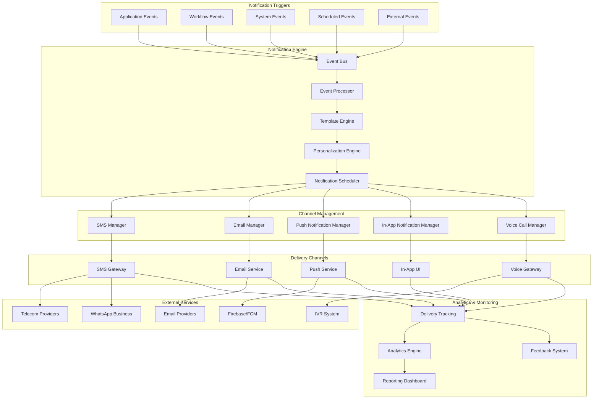

# Notification and Communication System Design

## System Architecture Overview



## Notification Types and Triggers

### 1. Transactional Notifications

#### Account and Authentication
```yaml
Authentication_Notifications:
  login_success:
    trigger: "Successful login"
    channels: ["sms", "email"]
    priority: "medium"
    template: "login_success"
    personalization:
      - user_name
      - login_time
      - device_info
      - location
  
  login_failure:
    trigger: "Failed login attempts (3+)"
    channels: ["sms", "email"]
    priority: "high"
    template: "security_alert"
    personalization:
      - user_name
      - attempt_count
      - timestamp
      - ip_address
  
  password_change:
    trigger: "Password changed"
    channels: ["sms", "email"]
    priority: "high"
    template: "password_changed"
    personalization:
      - user_name
      - change_time
      - device_info
  
  account_locked:
    trigger: "Account locked due to security"
    channels: ["sms", "email", "in_app"]
    priority: "critical"
    template: "account_locked"
    personalization:
      - user_name
      - lock_reason
      - unlock_instructions
```

#### PF Transaction Notifications
```yaml
PF_Transaction_Notifications:
  contribution_received:
    trigger: "Monthly contribution processed"
    channels: ["sms", "email", "in_app"]
    priority: "medium"
    template: "contribution_received"
    personalization:
      - user_name
      - contribution_amount
      - month_year
      - current_balance
  
  withdrawal_application:
    trigger: "Withdrawal application submitted"
    channels: ["sms", "email", "in_app"]
    priority: "high"
    template: "withdrawal_submitted"
    personalization:
      - user_name
      - application_number
      - withdrawal_amount
      - expected_processing_time
  
  withdrawal_approved:
    trigger: "Withdrawal application approved"
    channels: ["sms", "email", "in_app", "push"]
    priority: "high"
    template: "withdrawal_approved"
    personalization:
      - user_name
      - application_number
      - approved_amount
      - payment_timeline
  
  payment_processed:
    trigger: "Payment credited to account"
    channels: ["sms", "email", "in_app"]
    priority: "high"
    template: "payment_processed"
    personalization:
      - user_name
      - amount
      - account_number
      - transaction_id
      - payment_date
```

#### Pension Notifications
```yaml
Pension_Notifications:
  pension_disbursed:
    trigger: "Monthly pension credited"
    channels: ["sms", "email"]
    priority: "medium"
    template: "pension_disbursed"
    personalization:
      - pensioner_name
      - pension_amount
      - month_year
      - account_number
  
  life_certificate_due:
    trigger: "Life certificate submission due"
    channels: ["sms", "email", "voice"]
    priority: "high"
    template: "life_certificate_reminder"
    schedule: "30 days before, 15 days before, 7 days before"
    personalization:
      - pensioner_name
      - due_date
      - submission_methods
  
  pension_stopped:
    trigger: "Pension stopped due to non-submission"
    channels: ["sms", "email", "voice"]
    priority: "critical"
    template: "pension_stopped"
    personalization:
      - pensioner_name
      - stop_reason
      - restoration_process
```

### 2. Informational Notifications

#### System Updates
```yaml
System_Notifications:
  maintenance_scheduled:
    trigger: "Scheduled system maintenance"
    channels: ["email", "in_app", "website_banner"]
    priority: "medium"
    template: "maintenance_notice"
    schedule: "7 days before, 1 day before, 2 hours before"
    personalization:
      - maintenance_date
      - duration
      - affected_services
  
  new_feature_announcement:
    trigger: "New feature release"
    channels: ["email", "in_app", "push"]
    priority: "low"
    template: "feature_announcement"
    personalization:
      - feature_name
      - feature_benefits
      - how_to_access
  
  policy_updates:
    trigger: "EPFO policy changes"
    channels: ["email", "in_app", "sms"]
    priority: "high"
    template: "policy_update"
    personalization:
      - policy_name
      - effective_date
      - impact_summary
      - detailed_link
```

#### Compliance and Reminders
```yaml
Compliance_Notifications:
  ecr_filing_due:
    trigger: "ECR filing due date approaching"
    channels: ["email", "sms", "in_app"]
    priority: "high"
    template: "ecr_filing_reminder"
    schedule: "15 days before, 7 days before, 1 day before"
    audience: "hr_managers, org_admins"
    personalization:
      - organization_name
      - due_date
      - filing_month
      - penalty_info
  
  contribution_overdue:
    trigger: "Contribution payment overdue"
    channels: ["email", "sms", "voice"]
    priority: "critical"
    template: "contribution_overdue"
    schedule: "Daily until resolved"
    audience: "org_admins, finance_managers"
    personalization:
      - organization_name
      - overdue_amount
      - overdue_period
      - penalty_calculation
  
  document_expiry:
    trigger: "Document expiring soon"
    channels: ["email", "sms", "in_app"]
    priority: "medium"
    template: "document_expiry"
    schedule: "30 days before, 15 days before, 7 days before"
    personalization:
      - document_type
      - expiry_date
      - renewal_process
```

## Multi-Channel Communication Strategy

### 1. Channel Selection Logic

#### Priority-Based Channel Selection
```yaml
Channel_Priority_Matrix:
  critical_notifications:
    primary: ["sms", "voice"]
    secondary: ["email", "push"]
    fallback: ["in_app"]
    delivery_timeout: 5_minutes
  
  high_priority:
    primary: ["sms", "email"]
    secondary: ["push", "in_app"]
    fallback: ["voice"]
    delivery_timeout: 15_minutes
  
  medium_priority:
    primary: ["email", "in_app"]
    secondary: ["sms", "push"]
    fallback: []
    delivery_timeout: 1_hour
  
  low_priority:
    primary: ["in_app", "email"]
    secondary: ["push"]
    fallback: []
    delivery_timeout: 24_hours
```

#### User Preference Management
```yaml
User_Preferences:
  notification_settings:
    - notification_type: "transaction_alerts"
      preferred_channels: ["sms", "email"]
      frequency: "immediate"
      quiet_hours: "22:00-08:00"
    
    - notification_type: "reminders"
      preferred_channels: ["email", "in_app"]
      frequency: "daily_digest"
      quiet_hours: "20:00-09:00"
    
    - notification_type: "promotional"
      preferred_channels: ["email"]
      frequency: "weekly"
      opt_out: true
  
  channel_preferences:
    sms:
      enabled: true
      mobile_number: "+91XXXXXXXXXX"
      language: "english"
    
    email:
      enabled: true
      email_address: "user@example.com"
      format: "html"
      language: "english"
    
    push:
      enabled: true
      device_tokens: ["token1", "token2"]
    
    in_app:
      enabled: true
      show_badges: true
      sound_enabled: false
```

### 2. SMS Communication

#### SMS Gateway Configuration
```yaml
SMS_Configuration:
  primary_gateway:
    provider: "NIC SMS Gateway"
    endpoint: "https://sms.gov.in/api/v1/"
    authentication: "api_key"
    rate_limit: "10000/minute"
    delivery_report: true
  
  backup_gateways:
    - provider: "Airtel Business"
      endpoint: "https://api.airtel.in/sms/"
      rate_limit: "5000/minute"
    
    - provider: "BSNL Enterprise"
      endpoint: "https://enterprise.bsnl.in/sms/"
      rate_limit: "3000/minute"
  
  message_types:
    transactional:
      sender_id: "EPFIND"
      template_required: true
      dlt_registration: true
    
    promotional:
      sender_id: "EPFPRO"
      template_required: true
      opt_out_required: true
      time_restrictions: "09:00-21:00"
  
  regional_language_support:
    - hindi: "Devanagari script"
    - tamil: "Tamil script"
    - telugu: "Telugu script"
    - bengali: "Bengali script"
    - gujarati: "Gujarati script"
```

#### SMS Templates
```yaml
SMS_Templates:
  contribution_received:
    english: "Dear {user_name}, Your PF contribution of Rs.{amount} for {month} has been received. Current balance: Rs.{balance}. -EPFO"
    hindi: "प्रिय {user_name}, {month} के लिए आपका PF योगदान Rs.{amount} प्राप्त हुआ है। वर्तमान शेष: Rs.{balance}। -EPFO"
  
  withdrawal_approved:
    english: "Dear {user_name}, Your PF withdrawal application {app_no} for Rs.{amount} has been approved. Payment will be processed within {days} days. -EPFO"
    hindi: "प्रिय {user_name}, Rs.{amount} के लिए आपका PF निकासी आवेदन {app_no} स्वीकृत हो गया है। भुगतान {days} दिनों में किया जाएगा। -EPFO"
```

### 3. Email Communication

#### Email Service Configuration
```yaml
Email_Configuration:
  primary_service:
    provider: "Government Email Service"
    smtp_server: "smtp.gov.in"
    port: 587
    encryption: "STARTTLS"
    authentication: "oauth2"
  
  backup_services:
    - provider: "AWS SES"
      region: "ap-south-1"
      authentication: "iam_role"
    
    - provider: "SendGrid"
      api_endpoint: "https://api.sendgrid.com/v3/"
      authentication: "api_key"
  
  email_settings:
    from_address: "noreply@epfindia.gov.in"
    reply_to: "support@epfindia.gov.in"
    bounce_handling: true
    unsubscribe_link: true
    tracking: true
  
  template_engine:
    engine: "Handlebars"
    caching: true
    minification: true
    responsive_design: true
```

#### Email Templates
```yaml
Email_Templates:
  withdrawal_approved:
    subject: "PF Withdrawal Application Approved - {application_number}"
    template: |
      <!DOCTYPE html>
      <html>
      <head>
          <meta charset="UTF-8">
          <title>PF Withdrawal Approved</title>
      </head>
      <body>
          <div style="font-family: Arial, sans-serif; max-width: 600px; margin: 0 auto;">
              <header style="background-color: #1f4e79; color: white; padding: 20px; text-align: center;">
                  <h1>Employee Provident Fund Organisation</h1>
              </header>
              
              <main style="padding: 20px;">
                  <h2>Withdrawal Application Approved</h2>
                  
                  <p>Dear {{user_name}},</p>
                  
                  <p>We are pleased to inform you that your PF withdrawal application has been approved.</p>
                  
                  <div style="background-color: #f5f5f5; padding: 15px; margin: 20px 0; border-left: 4px solid #1f4e79;">
                      <h3>Application Details:</h3>
                      <ul>
                          <li><strong>Application Number:</strong> {{application_number}}</li>
                          <li><strong>Approved Amount:</strong> ₹{{approved_amount}}</li>
                          <li><strong>Processing Date:</strong> {{processing_date}}</li>
                          <li><strong>Expected Payment:</strong> {{payment_timeline}}</li>
                      </ul>
                  </div>
                  
                  <p>The approved amount will be credited to your registered bank account within the specified timeline.</p>
                  
                  <div style="background-color: #e8f4fd; padding: 15px; margin: 20px 0; border-radius: 5px;">
                      <h4>Next Steps:</h4>
                      <ol>
                          <li>Monitor your bank account for the credit</li>
                          <li>Download your settlement certificate from the portal</li>
                          <li>Contact us if payment is not received within the timeline</li>
                      </ol>
                  </div>
                  
                  <p>For any queries, please contact our helpline at 1800-118-005 or visit our website.</p>
                  
                  <p>Thank you for using EPFO services.</p>
                  
                  <p>Best regards,<br>
                  Employee Provident Fund Organisation</p>
              </main>
              
              <footer style="background-color: #f0f0f0; padding: 15px; text-align: center; font-size: 12px;">
                  <p>This is an automated message. Please do not reply to this email.</p>
                  <p>© 2024 Employee Provident Fund Organisation, Government of India</p>
              </footer>
          </div>
      </body>
      </html>
```

### 4. Push Notifications

#### Push Notification Configuration
```yaml
Push_Notification_Config:
  android:
    service: "Firebase Cloud Messaging (FCM)"
    server_key: "encrypted_server_key"
    sender_id: "project_sender_id"
    
  ios:
    service: "Apple Push Notification Service (APNs)"
    certificate: "production_certificate"
    bundle_id: "in.gov.epfo.mobile"
  
  web:
    service: "Web Push Protocol"
    vapid_keys: "public_private_key_pair"
    
  notification_types:
    - data_only: "Silent notifications for data sync"
    - display: "User-visible notifications"
    - interactive: "Notifications with action buttons"
  
  delivery_options:
    priority: "high"
    time_to_live: 86400  # 24 hours
    collapse_key: "notification_type"
    badge_count: true
```

### 5. In-App Notifications

#### In-App Notification System
```yaml
In_App_Notifications:
  notification_center:
    location: "Header navigation"
    badge_display: true
    real_time_updates: true
    notification_history: 30_days
  
  notification_types:
    - toast: "Temporary overlay messages"
    - banner: "Top banner notifications"
    - modal: "Important announcements"
    - badge: "Unread count indicators"
  
  real_time_delivery:
    technology: "WebSocket/Server-Sent Events"
    fallback: "Polling every 30 seconds"
    offline_support: true
    sync_on_reconnect: true
  
  notification_persistence:
    storage: "Browser localStorage"
    encryption: true
    cleanup_policy: "30 days retention"
```

## Personalization and Localization

### 1. Content Personalization

#### Dynamic Content Generation
```yaml
Personalization_Engine:
  user_segmentation:
    - employee_type: ["active", "ex_employee", "pensioner"]
    - organization_size: ["small", "medium", "large", "enterprise"]
    - engagement_level: ["high", "medium", "low"]
    - preferred_language: ["english", "hindi", "regional"]
  
  content_adaptation:
    - greeting_personalization: "Time-based greetings"
    - content_relevance: "Role-based content filtering"
    - action_recommendations: "Contextual suggestions"
    - frequency_optimization: "User behavior-based timing"
  
  dynamic_variables:
    - user_profile: "Name, designation, organization"
    - account_info: "Balance, contributions, transactions"
    - contextual_data: "Location, time, device"
    - behavioral_data: "Usage patterns, preferences"
```

### 2. Multi-Language Support

#### Language Configuration
```yaml
Localization_Support:
  supported_languages:
    - english: "Default language"
    - hindi: "National language"
    - tamil: "Regional language"
    - telugu: "Regional language"
    - bengali: "Regional language"
    - gujarati: "Regional language"
    - marathi: "Regional language"
    - kannada: "Regional language"
    - malayalam: "Regional language"
    - punjabi: "Regional language"
  
  translation_management:
    - translation_keys: "Centralized key management"
    - professional_translation: "Certified translators"
    - cultural_adaptation: "Region-specific content"
    - regular_updates: "Continuous translation updates"
  
  font_support:
    - devanagari: "Hindi, Marathi"
    - tamil_script: "Tamil"
    - telugu_script: "Telugu"
    - bengali_script: "Bengali"
    - gujarati_script: "Gujarati"
```

## Analytics and Monitoring

### 1. Delivery Analytics

#### Metrics Tracking
```yaml
Delivery_Metrics:
  channel_performance:
    - delivery_rate: "Percentage of successful deliveries"
    - bounce_rate: "Failed delivery percentage"
    - open_rate: "Email/push notification opens"
    - click_rate: "Link clicks in notifications"
    - response_time: "Time to deliver notification"
  
  user_engagement:
    - read_rate: "Notifications read by users"
    - action_rate: "Actions taken from notifications"
    - unsubscribe_rate: "Opt-out rate by channel"
    - preference_changes: "User preference modifications"
  
  system_performance:
    - throughput: "Notifications sent per minute"
    - queue_depth: "Pending notifications"
    - error_rate: "System error percentage"
    - latency: "End-to-end delivery time"
```

### 2. Real-time Monitoring

#### Monitoring Dashboard
```yaml
Monitoring_Dashboard:
  real_time_metrics:
    - active_notifications: "Currently processing"
    - delivery_status: "Success/failure rates"
    - channel_health: "Service availability"
    - queue_status: "Pending notifications"
  
  alerting_rules:
    - high_failure_rate: "Failure rate > 10%"
    - queue_backup: "Queue depth > 10000"
    - service_down: "Channel unavailable"
    - slow_delivery: "Delivery time > 5 minutes"
  
  reporting:
    - daily_summary: "Daily delivery report"
    - weekly_trends: "Weekly performance trends"
    - monthly_analysis: "Monthly analytics report"
    - custom_reports: "Ad-hoc reporting capability"
```

## Compliance and Governance

### 1. Regulatory Compliance

#### TRAI Compliance (SMS)
```yaml
TRAI_Compliance:
  dlt_registration:
    - sender_id_registration: "Registered sender IDs"
    - template_registration: "Pre-approved templates"
    - consent_management: "User consent tracking"
  
  spam_prevention:
    - opt_out_mechanism: "Easy unsubscribe process"
    - frequency_limits: "Maximum messages per day"
    - time_restrictions: "No messages 9 PM - 9 AM"
    - content_filtering: "Spam content detection"
```

#### Data Privacy Compliance
```yaml
Privacy_Compliance:
  data_protection:
    - consent_management: "Explicit user consent"
    - data_minimization: "Only necessary data collection"
    - purpose_limitation: "Use data only for stated purpose"
    - retention_limits: "Delete data after retention period"
  
  user_rights:
    - access_right: "Users can view their data"
    - correction_right: "Users can correct their data"
    - deletion_right: "Users can delete their data"
    - portability_right: "Users can export their data"
```

This comprehensive notification and communication system ensures effective, personalized, and compliant communication with all stakeholders while maintaining high delivery rates and user satisfaction.