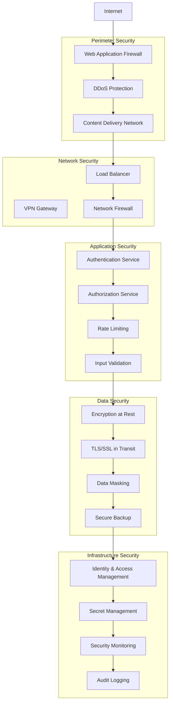
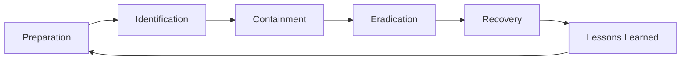

# Security and Compliance Framework

## Security Architecture Overview

### Defense in Depth Strategy



## Authentication and Authorization

### 1. Multi-Factor Authentication (MFA)

#### Authentication Methods
```yaml
Primary Authentication:
  - Username/Password
  - Aadhaar-based authentication
  - Mobile OTP
  - Email OTP

Secondary Authentication:
  - SMS OTP
  - Email OTP
  - Authenticator App (TOTP)
  - Hardware Security Keys (FIDO2)
  - Biometric authentication (mobile)

Risk-Based Authentication:
  - Device fingerprinting
  - Geolocation analysis
  - Behavioral analytics
  - Time-based access patterns
```

#### MFA Implementation Strategy
```javascript
// Example MFA flow
const authenticationFlow = {
  step1: {
    method: "primary_credential",
    options: ["password", "aadhaar", "mobile_otp"],
    required: true
  },
  step2: {
    method: "secondary_factor",
    options: ["sms_otp", "email_otp", "totp", "fido2"],
    required: true,
    riskBased: true
  },
  step3: {
    method: "device_verification",
    options: ["trusted_device", "device_registration"],
    required: false,
    conditions: ["new_device", "high_risk_transaction"]
  }
};
```

### 2. Role-Based Access Control (RBAC)

#### Permission Matrix
```yaml
Permissions:
  user_management:
    - create_user
    - read_user
    - update_user
    - delete_user
    - assign_roles
  
  pf_operations:
    - view_balance
    - apply_withdrawal
    - approve_withdrawal
    - process_transfer
    - calculate_interest
  
  organization_management:
    - register_organization
    - manage_employees
    - file_ecr
    - make_payments
    - generate_reports
  
  system_administration:
    - system_configuration
    - user_role_management
    - audit_log_access
    - system_monitoring
    - backup_restore

Role_Assignments:
  employee:
    permissions: [view_balance, apply_withdrawal, update_profile]
    scope: "self"
  
  hr_manager:
    permissions: [manage_employees, file_ecr, generate_reports]
    scope: "organization"
  
  org_admin:
    permissions: [organization_management, user_management]
    scope: "organization"
  
  epfo_officer:
    permissions: [approve_withdrawal, process_transfer, audit_access]
    scope: "regional"
  
  system_admin:
    permissions: [system_administration, all_operations]
    scope: "global"
```

### 3. Session Management

#### Secure Session Configuration
```yaml
Session_Security:
  session_timeout:
    idle_timeout: 30_minutes
    absolute_timeout: 8_hours
    warning_before_expiry: 5_minutes
  
  session_storage:
    type: "redis_cluster"
    encryption: "AES-256-GCM"
    secure_flag: true
    httponly_flag: true
    samesite: "strict"
  
  concurrent_sessions:
    max_sessions_per_user: 3
    device_tracking: true
    session_invalidation: "on_password_change"
  
  session_validation:
    ip_validation: true
    user_agent_validation: true
    csrf_protection: true
    session_rotation: "on_privilege_escalation"
```

## Data Protection and Privacy

### 1. Data Classification

#### Data Categories
```yaml
Public_Data:
  - General information about EPFO schemes
  - Public announcements
  - Help documentation
  - Contact information

Internal_Data:
  - System logs (non-sensitive)
  - Performance metrics
  - Usage statistics
  - Configuration data

Confidential_Data:
  - Employee personal information
  - Organization details
  - Financial transactions
  - Contribution records

Restricted_Data:
  - Aadhaar numbers
  - Bank account details
  - Salary information
  - Medical certificates

Top_Secret_Data:
  - System credentials
  - Encryption keys
  - Security configurations
  - Audit logs
```

### 2. Encryption Strategy

#### Encryption at Rest
```yaml
Database_Encryption:
  method: "Transparent Data Encryption (TDE)"
  algorithm: "AES-256"
  key_management: "Hardware Security Module (HSM)"
  key_rotation: "quarterly"

Field_Level_Encryption:
  sensitive_fields:
    - aadhaar_number: "AES-256-GCM"
    - bank_account: "AES-256-GCM"
    - salary_details: "AES-256-GCM"
    - mobile_number: "AES-256-GCM"
  
  key_derivation: "PBKDF2"
  salt_generation: "cryptographically_secure_random"

File_Storage_Encryption:
  documents: "AES-256-CBC"
  backups: "AES-256-GCM"
  logs: "ChaCha20-Poly1305"
```

#### Encryption in Transit
```yaml
TLS_Configuration:
  version: "TLS 1.3"
  cipher_suites:
    - "TLS_AES_256_GCM_SHA384"
    - "TLS_CHACHA20_POLY1305_SHA256"
    - "TLS_AES_128_GCM_SHA256"
  
  certificate_management:
    type: "Extended Validation (EV)"
    renewal: "automated"
    monitoring: "continuous"
  
  hsts_policy:
    max_age: "31536000"
    include_subdomains: true
    preload: true

API_Security:
  authentication: "OAuth 2.0 + JWT"
  encryption: "TLS 1.3"
  message_signing: "HMAC-SHA256"
  rate_limiting: "token_bucket"
```

### 3. Data Masking and Anonymization

#### Data Masking Rules
```yaml
Production_Data_Masking:
  aadhaar_number:
    method: "partial_masking"
    pattern: "XXXX-XXXX-1234"
  
  bank_account:
    method: "partial_masking"
    pattern: "XXXXXXXX1234"
  
  mobile_number:
    method: "partial_masking"
    pattern: "XXXXXX7890"
  
  salary:
    method: "range_masking"
    ranges: ["0-25K", "25K-50K", "50K-100K", "100K+"]

Test_Data_Anonymization:
  personal_data:
    method: "synthetic_data_generation"
    preserve_relationships: true
    maintain_statistics: true
  
  financial_data:
    method: "differential_privacy"
    epsilon: 1.0
    delta: 1e-5
```

## Compliance Framework

### 1. Regulatory Compliance

#### Indian Government Compliance
```yaml
IT_Act_2000:
  requirements:
    - Digital signature compliance
    - Electronic record maintenance
    - Data protection measures
    - Cyber security framework
  
  implementation:
    - Digital signature integration
    - Audit trail maintenance
    - Incident response procedures
    - Regular security assessments

Aadhaar_Act_2016:
  requirements:
    - Aadhaar data protection
    - Purpose limitation
    - Storage limitation
    - Access controls
  
  implementation:
    - Encrypted Aadhaar storage
    - Purpose-based access
    - Data retention policies
    - Regular compliance audits

DPDP_Act_2023:
  requirements:
    - Data protection by design
    - Consent management
    - Data breach notification
    - Individual rights protection
  
  implementation:
    - Privacy by design architecture
    - Consent management system
    - Breach detection and notification
    - Data subject rights portal

RBI_Guidelines:
  requirements:
    - Payment security standards
    - Transaction monitoring
    - Fraud prevention
    - Customer authentication
  
  implementation:
    - PCI DSS compliance
    - Real-time fraud detection
    - Strong customer authentication
    - Transaction limits and monitoring
```

### 2. International Standards Compliance

#### ISO 27001 Implementation
```yaml
Information_Security_Management:
  policies:
    - Information security policy
    - Access control policy
    - Incident response policy
    - Business continuity policy
  
  controls:
    - A.5: Information security policies
    - A.6: Organization of information security
    - A.7: Human resource security
    - A.8: Asset management
    - A.9: Access control
    - A.10: Cryptography
    - A.11: Physical and environmental security
    - A.12: Operations security
    - A.13: Communications security
    - A.14: System acquisition, development and maintenance
    - A.15: Supplier relationships
    - A.16: Information security incident management
    - A.17: Information security aspects of business continuity
    - A.18: Compliance

SOC_2_Type_II:
  trust_criteria:
    - Security
    - Availability
    - Processing integrity
    - Confidentiality
    - Privacy
  
  controls:
    - Logical and physical access controls
    - System operations
    - Change management
    - Risk mitigation
    - Data protection
```

## Security Monitoring and Incident Response

### 1. Security Information and Event Management (SIEM)

#### SIEM Architecture
```yaml
Log_Sources:
  - Application logs
  - Database logs
  - Network logs
  - System logs
  - Security device logs
  - User activity logs

Event_Correlation:
  - Failed login attempts
  - Privilege escalation
  - Data access patterns
  - Network anomalies
  - System configuration changes
  - File integrity violations

Alerting_Rules:
  high_priority:
    - Multiple failed login attempts
    - Unauthorized data access
    - System compromise indicators
    - Data exfiltration attempts
  
  medium_priority:
    - Unusual user behavior
    - Configuration changes
    - Performance anomalies
    - Policy violations
  
  low_priority:
    - Routine security events
    - System maintenance activities
    - Normal user activities
    - Scheduled tasks
```

### 2. Threat Detection and Response

#### Threat Detection Capabilities
```yaml
Real_Time_Monitoring:
  - Intrusion detection system (IDS)
  - Intrusion prevention system (IPS)
  - Web application firewall (WAF)
  - Database activity monitoring (DAM)
  - File integrity monitoring (FIM)
  - User behavior analytics (UBA)

Threat_Intelligence:
  - External threat feeds
  - Vulnerability databases
  - Malware signatures
  - IP reputation lists
  - Domain reputation
  - Attack pattern recognition

Automated_Response:
  - Account lockout
  - IP blocking
  - Session termination
  - Alert generation
  - Incident creation
  - Escalation procedures
```

### 3. Incident Response Plan

#### Incident Response Phases


#### Incident Classification
```yaml
Severity_Levels:
  critical:
    description: "System compromise, data breach, service unavailable"
    response_time: "15 minutes"
    escalation: "CISO, CTO, CEO"
    communication: "All stakeholders"
  
  high:
    description: "Security violation, performance degradation"
    response_time: "1 hour"
    escalation: "Security team, IT management"
    communication: "IT team, management"
  
  medium:
    description: "Policy violation, minor security event"
    response_time: "4 hours"
    escalation: "Security team"
    communication: "Security team"
  
  low:
    description: "Informational, routine events"
    response_time: "24 hours"
    escalation: "None"
    communication: "Security team"

Response_Team:
  incident_commander:
    role: "Overall incident coordination"
    responsibilities: ["Decision making", "Communication", "Resource allocation"]
  
  security_analyst:
    role: "Technical investigation"
    responsibilities: ["Evidence collection", "Analysis", "Containment"]
  
  system_administrator:
    role: "System recovery"
    responsibilities: ["System restoration", "Configuration", "Monitoring"]
  
  communication_lead:
    role: "Stakeholder communication"
    responsibilities: ["Status updates", "Media relations", "User communication"]
```

## Audit and Compliance Monitoring

### 1. Audit Trail Requirements

#### Audit Log Standards
```yaml
Audit_Events:
  authentication:
    - Login attempts (success/failure)
    - Logout events
    - Password changes
    - MFA events
    - Session timeouts
  
  authorization:
    - Permission grants/revokes
    - Role assignments
    - Access attempts
    - Privilege escalations
    - Policy changes
  
  data_access:
    - Data queries
    - Data modifications
    - Data exports
    - File downloads
    - Report generation
  
  system_events:
    - Configuration changes
    - System startups/shutdowns
    - Service failures
    - Backup operations
    - Maintenance activities

Log_Format:
  timestamp: "ISO 8601 format"
  user_id: "Unique identifier"
  session_id: "Session identifier"
  source_ip: "Client IP address"
  user_agent: "Browser/application info"
  action: "Specific action performed"
  resource: "Affected resource"
  result: "Success/failure status"
  details: "Additional context"
```

### 2. Compliance Reporting

#### Automated Compliance Reports
```yaml
Daily_Reports:
  - Failed login attempts
  - Privilege escalations
  - Data access violations
  - System errors
  - Performance metrics

Weekly_Reports:
  - User activity summary
  - Security event trends
  - System health status
  - Compliance violations
  - Risk assessments

Monthly_Reports:
  - Comprehensive security review
  - Compliance status
  - Incident summary
  - Risk register updates
  - Performance analysis

Quarterly_Reports:
  - Security posture assessment
  - Compliance audit results
  - Risk management review
  - Business continuity testing
  - Security training effectiveness
```

## Business Continuity and Disaster Recovery

### 1. Business Continuity Planning

#### Recovery Objectives
```yaml
Recovery_Time_Objectives:
  critical_services: "4 hours"
  important_services: "24 hours"
  normal_services: "72 hours"

Recovery_Point_Objectives:
  critical_data: "15 minutes"
  important_data: "1 hour"
  normal_data: "24 hours"

Service_Priorities:
  tier_1:
    - User authentication
    - PF balance inquiry
    - Critical transactions
  
  tier_2:
    - Report generation
    - Bulk operations
    - Administrative functions
  
  tier_3:
    - Analytics
    - Non-critical reports
    - Training systems
```

### 2. Disaster Recovery Strategy

#### Multi-Site Architecture
```yaml
Primary_Site:
  location: "Mumbai Data Center"
  capacity: "100% production load"
  services: "All services active"
  backup_frequency: "Real-time replication"

Secondary_Site:
  location: "Delhi Data Center"
  capacity: "100% production load"
  services: "Hot standby"
  failover_time: "< 4 hours"

Tertiary_Site:
  location: "Bangalore Data Center"
  capacity: "50% production load"
  services: "Cold standby"
  failover_time: "< 24 hours"

Cloud_Backup:
  provider: "Multi-cloud strategy"
  capacity: "Archive and backup"
  services: "Data recovery"
  recovery_time: "< 72 hours"
```

This comprehensive security and compliance framework ensures that the EPFO portal meets all regulatory requirements while maintaining the highest standards of security and data protection.