# System Architecture and Data Model Design

## High-Level System Architecture

### Architecture Overview
The EPFO portal follows a modern microservices architecture with multi-tenant capabilities, designed for scalability, security, and maintainability.

```mermaid
graph TB
    subgraph "Client Layer"
        WEB[Web Application]
        MOBILE[Mobile App]
        API_CLIENT[Third-party APIs]
    end
    
    subgraph "API Gateway Layer"
        GATEWAY[API Gateway]
        AUTH[Authentication Service]
        RATE_LIMIT[Rate Limiting]
    end
    
    subgraph "Application Layer"
        USER_SVC[User Management Service]
        ORG_SVC[Organization Service]
        PF_SVC[Provident Fund Service]
        PENSION_SVC[Pension Service]
        INSURANCE_SVC[Insurance Service]
        PAYMENT_SVC[Payment Service]
        NOTIFICATION_SVC[Notification Service]
        DOCUMENT_SVC[Document Service]
        REPORTING_SVC[Reporting Service]
        WORKFLOW_SVC[Workflow Service]
    end
    
    subgraph "Data Layer"
        USER_DB[(User Database)]
        ORG_DB[(Organization Database)]
        TRANSACTION_DB[(Transaction Database)]
        DOCUMENT_DB[(Document Store)]
        CACHE[(Redis Cache)]
        SEARCH[(Elasticsearch)]
    end
    
    subgraph "External Systems"
        BANK_API[Banking APIs]
        GOVT_API[Government APIs]
        SMS_API[SMS Gateway]
        EMAIL_API[Email Service]
        PAYMENT_GATEWAY[Payment Gateway]
    end
    
    WEB --> GATEWAY
    MOBILE --> GATEWAY
    API_CLIENT --> GATEWAY
    
    GATEWAY --> AUTH
    GATEWAY --> RATE_LIMIT
    GATEWAY --> USER_SVC
    GATEWAY --> ORG_SVC
    GATEWAY --> PF_SVC
    GATEWAY --> PENSION_SVC
    GATEWAY --> INSURANCE_SVC
    
    USER_SVC --> USER_DB
    ORG_SVC --> ORG_DB
    PF_SVC --> TRANSACTION_DB
    PENSION_SVC --> TRANSACTION_DB
    INSURANCE_SVC --> TRANSACTION_DB
    
    PAYMENT_SVC --> PAYMENT_GATEWAY
    NOTIFICATION_SVC --> SMS_API
    NOTIFICATION_SVC --> EMAIL_API
    DOCUMENT_SVC --> DOCUMENT_DB
    REPORTING_SVC --> SEARCH
    
    USER_SVC --> CACHE
    ORG_SVC --> CACHE
    PF_SVC --> CACHE
```



## Microservices Architecture

### 1. User Management Service
**Responsibilities**:
- User authentication and authorization
- Profile management
- Role-based access control
- Multi-factor authentication
- Session management

**Key Features**:
- JWT token-based authentication
- OAuth 2.0 integration
- LDAP/AD integration for organizations
- Audit logging
- Password policies

### 2. Organization Service
**Responsibilities**:
- Organization onboarding and management
- Tenant isolation and configuration
- Branch/location management
- Organization hierarchy
- Custom branding and themes

**Key Features**:
- Multi-tenant data isolation
- Organization-specific configurations
- Hierarchical organization structure
- Custom workflow definitions
- Branding customization

### 3. Provident Fund Service
**Responsibilities**:
- PF account management
- Contribution calculations
- Balance inquiries
- Transfer processing
- Withdrawal processing

**Key Features**:
- Real-time balance calculations
- Automated contribution processing
- Transfer workflow management
- Interest calculations
- Compliance validations

### 4. Pension Service
**Responsibilities**:
- EPS account management
- Pension calculations
- Pension disbursement
- Life certificate management
- Pension transfer processing

**Key Features**:
- Pension calculation engine
- Automated disbursement
- Life certificate validation
- Pension certificate generation
- Survivor benefit processing

### 5. Insurance Service
**Responsibilities**:
- EDLI policy management
- Insurance claim processing
- Nominee management
- Premium calculations
- Claim settlements

**Key Features**:
- Policy lifecycle management
- Automated claim processing
- Nominee verification
- Premium calculation engine
- Settlement processing

### 6. Payment Service
**Responsibilities**:
- Payment processing
- Payment gateway integration
- Transaction management
- Reconciliation
- Refund processing

**Key Features**:
- Multiple payment gateway support
- Automated reconciliation
- Transaction tracking
- Refund management
- Payment analytics

### 7. Notification Service
**Responsibilities**:
- Multi-channel notifications
- Template management
- Delivery tracking
- Preference management
- Bulk notifications

**Key Features**:
- SMS, Email, Push notifications
- Template engine
- Delivery status tracking
- User preferences
- Scheduled notifications

### 8. Document Service
**Responsibilities**:
- Document storage and management
- Digital signature integration
- Document verification
- Version control
- Access control

**Key Features**:
- Secure document storage
- Digital signature support
- OCR capabilities
- Document templates
- Audit trails

### 9. Reporting Service
**Responsibilities**:
- Report generation
- Analytics and dashboards
- Data visualization
- Scheduled reports
- Export capabilities

**Key Features**:
- Real-time dashboards
- Custom report builder
- Data export (PDF, Excel, CSV)
- Scheduled report delivery
- Performance analytics

### 10. Workflow Service
**Responsibilities**:
- Business process management
- Approval workflows
- Task management
- SLA monitoring
- Escalation handling

**Key Features**:
- Configurable workflows
- Approval chains
- Task assignment
- SLA tracking
- Automated escalations

## Data Model Design

### Core Entities

#### 1. Organization Entity
```sql
CREATE TABLE organizations (
    id UUID PRIMARY KEY,
    name VARCHAR(255) NOT NULL,
    code VARCHAR(50) UNIQUE NOT NULL,
    type ENUM('private', 'government', 'psu') NOT NULL,
    registration_number VARCHAR(100),
    pan_number VARCHAR(10),
    tan_number VARCHAR(10),
    address JSONB,
    contact_info JSONB,
    status ENUM('active', 'inactive', 'suspended') DEFAULT 'active',
    settings JSONB,
    created_at TIMESTAMP DEFAULT CURRENT_TIMESTAMP,
    updated_at TIMESTAMP DEFAULT CURRENT_TIMESTAMP
);

CREATE TABLE organization_branches (
    id UUID PRIMARY KEY,
    organization_id UUID REFERENCES organizations(id),
    name VARCHAR(255) NOT NULL,
    code VARCHAR(50) NOT NULL,
    address JSONB,
    contact_info JSONB,
    status ENUM('active', 'inactive') DEFAULT 'active',
    created_at TIMESTAMP DEFAULT CURRENT_TIMESTAMP,
    updated_at TIMESTAMP DEFAULT CURRENT_TIMESTAMP
);
```

#### 2. User Entity
```sql
CREATE TABLE users (
    id UUID PRIMARY KEY,
    organization_id UUID REFERENCES organizations(id),
    employee_id VARCHAR(50),
    uan_number VARCHAR(12) UNIQUE,
    pf_number VARCHAR(50),
    first_name VARCHAR(100) NOT NULL,
    last_name VARCHAR(100) NOT NULL,
    email VARCHAR(255) UNIQUE,
    phone VARCHAR(15),
    date_of_birth DATE,
    gender ENUM('male', 'female', 'other'),
    address JSONB,
    kyc_details JSONB,
    bank_details JSONB,
    nomination_details JSONB,
    status ENUM('active', 'inactive', 'suspended') DEFAULT 'active',
    created_at TIMESTAMP DEFAULT CURRENT_TIMESTAMP,
    updated_at TIMESTAMP DEFAULT CURRENT_TIMESTAMP
);

CREATE TABLE user_roles (
    id UUID PRIMARY KEY,
    user_id UUID REFERENCES users(id),
    role_name VARCHAR(50) NOT NULL,
    permissions JSONB,
    granted_by UUID REFERENCES users(id),
    granted_at TIMESTAMP DEFAULT CURRENT_TIMESTAMP,
    expires_at TIMESTAMP
);
```

#### 3. PF Account Entity
```sql
CREATE TABLE pf_accounts (
    id UUID PRIMARY KEY,
    user_id UUID REFERENCES users(id),
    organization_id UUID REFERENCES organizations(id),
    pf_number VARCHAR(50) UNIQUE NOT NULL,
    uan_number VARCHAR(12) NOT NULL,
    date_of_joining DATE NOT NULL,
    date_of_exit DATE,
    basic_salary DECIMAL(12,2),
    da_salary DECIMAL(12,2),
    status ENUM('active', 'inactive', 'transferred', 'settled') DEFAULT 'active',
    created_at TIMESTAMP DEFAULT CURRENT_TIMESTAMP,
    updated_at TIMESTAMP DEFAULT CURRENT_TIMESTAMP
);

CREATE TABLE pf_contributions (
    id UUID PRIMARY KEY,
    pf_account_id UUID REFERENCES pf_accounts(id),
    month_year DATE NOT NULL,
    employee_contribution DECIMAL(12,2) NOT NULL,
    employer_contribution DECIMAL(12,2) NOT NULL,
    pension_contribution DECIMAL(12,2) NOT NULL,
    admin_charges DECIMAL(12,2) DEFAULT 0,
    edli_charges DECIMAL(12,2) DEFAULT 0,
    interest_rate DECIMAL(5,2),
    interest_amount DECIMAL(12,2),
    status ENUM('pending', 'processed', 'rejected') DEFAULT 'pending',
    created_at TIMESTAMP DEFAULT CURRENT_TIMESTAMP,
    updated_at TIMESTAMP DEFAULT CURRENT_TIMESTAMP
);
```

#### 4. Pension Account Entity
```sql
CREATE TABLE pension_accounts (
    id UUID PRIMARY KEY,
    user_id UUID REFERENCES users(id),
    pf_account_id UUID REFERENCES pf_accounts(id),
    eps_number VARCHAR(50) UNIQUE,
    pensionable_service_years INTEGER,
    pensionable_salary DECIMAL(12,2),
    monthly_pension DECIMAL(12,2),
    commutation_amount DECIMAL(12,2),
    pension_start_date DATE,
    status ENUM('active', 'inactive', 'suspended') DEFAULT 'active',
    created_at TIMESTAMP DEFAULT CURRENT_TIMESTAMP,
    updated_at TIMESTAMP DEFAULT CURRENT_TIMESTAMP
);

CREATE TABLE pension_payments (
    id UUID PRIMARY KEY,
    pension_account_id UUID REFERENCES pension_accounts(id),
    payment_month DATE NOT NULL,
    pension_amount DECIMAL(12,2) NOT NULL,
    da_amount DECIMAL(12,2) DEFAULT 0,
    medical_allowance DECIMAL(12,2) DEFAULT 0,
    deductions DECIMAL(12,2) DEFAULT 0,
    net_amount DECIMAL(12,2) NOT NULL,
    payment_date DATE,
    payment_status ENUM('pending', 'processed', 'failed') DEFAULT 'pending',
    created_at TIMESTAMP DEFAULT CURRENT_TIMESTAMP
);
```

#### 5. Insurance Entity
```sql
CREATE TABLE insurance_policies (
    id UUID PRIMARY KEY,
    user_id UUID REFERENCES users(id),
    pf_account_id UUID REFERENCES pf_accounts(id),
    policy_number VARCHAR(50) UNIQUE,
    sum_assured DECIMAL(12,2) NOT NULL,
    premium_amount DECIMAL(12,2) NOT NULL,
    policy_start_date DATE NOT NULL,
    policy_end_date DATE,
    nominee_details JSONB,
    status ENUM('active', 'inactive', 'claimed', 'expired') DEFAULT 'active',
    created_at TIMESTAMP DEFAULT CURRENT_TIMESTAMP,
    updated_at TIMESTAMP DEFAULT CURRENT_TIMESTAMP
);

CREATE TABLE insurance_claims (
    id UUID PRIMARY KEY,
    policy_id UUID REFERENCES insurance_policies(id),
    claim_number VARCHAR(50) UNIQUE,
    claim_type ENUM('death', 'disability', 'maturity'),
    claim_amount DECIMAL(12,2),
    claimant_details JSONB,
    documents JSONB,
    claim_date DATE NOT NULL,
    processing_status ENUM('submitted', 'under_review', 'approved', 'rejected', 'settled'),
    settlement_amount DECIMAL(12,2),
    settlement_date DATE,
    created_at TIMESTAMP DEFAULT CURRENT_TIMESTAMP,
    updated_at TIMESTAMP DEFAULT CURRENT_TIMESTAMP
);
```

#### 6. Transaction Entity
```sql
CREATE TABLE transactions (
    id UUID PRIMARY KEY,
    user_id UUID REFERENCES users(id),
    organization_id UUID REFERENCES organizations(id),
    transaction_type ENUM('contribution', 'withdrawal', 'transfer', 'interest', 'pension_payment'),
    reference_number VARCHAR(50) UNIQUE,
    amount DECIMAL(12,2) NOT NULL,
    description TEXT,
    transaction_date DATE NOT NULL,
    processing_date DATE,
    status ENUM('pending', 'processing', 'completed', 'failed', 'cancelled'),
    metadata JSONB,
    created_at TIMESTAMP DEFAULT CURRENT_TIMESTAMP,
    updated_at TIMESTAMP DEFAULT CURRENT_TIMESTAMP
);
```

#### 7. Document Entity
```sql
CREATE TABLE documents (
    id UUID PRIMARY KEY,
    user_id UUID REFERENCES users(id),
    organization_id UUID REFERENCES organizations(id),
    document_type VARCHAR(50) NOT NULL,
    document_name VARCHAR(255) NOT NULL,
    file_path VARCHAR(500) NOT NULL,
    file_size BIGINT,
    mime_type VARCHAR(100),
    checksum VARCHAR(64),
    is_verified BOOLEAN DEFAULT FALSE,
    verified_by UUID REFERENCES users(id),
    verified_at TIMESTAMP,
    expiry_date DATE,
    metadata JSONB,
    created_at TIMESTAMP DEFAULT CURRENT_TIMESTAMP,
    updated_at TIMESTAMP DEFAULT CURRENT_TIMESTAMP
);
```

## Multi-Tenant Data Strategy

### Tenant Isolation Approaches

#### 1. Database Per Tenant
- **Pros**: Complete isolation, easy backup/restore, custom schemas
- **Cons**: High resource usage, complex maintenance
- **Use Case**: Large organizations with specific requirements

#### 2. Schema Per Tenant
- **Pros**: Good isolation, shared infrastructure, easier maintenance
- **Cons**: Limited by database schema limits, complex queries
- **Use Case**: Medium-sized organizations

#### 3. Shared Database with Tenant ID
- **Pros**: Cost-effective, easy scaling, simple maintenance
- **Cons**: Risk of data leakage, complex security
- **Use Case**: Small to medium organizations (Recommended)

### Recommended Approach: Hybrid Model
```sql
-- Tenant configuration table
CREATE TABLE tenants (
    id UUID PRIMARY KEY,
    organization_id UUID REFERENCES organizations(id),
    database_strategy ENUM('shared', 'dedicated_schema', 'dedicated_db'),
    connection_string VARCHAR(500),
    schema_name VARCHAR(100),
    settings JSONB,
    created_at TIMESTAMP DEFAULT CURRENT_TIMESTAMP
);

-- Row-level security for shared tables
ALTER TABLE users ENABLE ROW LEVEL SECURITY;
CREATE POLICY user_tenant_policy ON users
    FOR ALL TO application_role
    USING (organization_id = current_setting('app.current_tenant_id')::UUID);
```

## Scalability and Performance Considerations

### Database Optimization
1. **Indexing Strategy**
   - Composite indexes on tenant_id + frequently queried columns
   - Partial indexes for status-based queries
   - Full-text search indexes for document content

2. **Partitioning Strategy**
   - Horizontal partitioning by tenant_id
   - Time-based partitioning for transaction tables
   - Archive old data to separate partitions

3. **Caching Strategy**
   - Redis for session management
   - Application-level caching for frequently accessed data
   - CDN for static assets and documents

### Application Optimization
1. **Connection Pooling**
   - Tenant-aware connection pools
   - Connection multiplexing
   - Prepared statement caching

2. **Query Optimization**
   - Tenant-scoped queries
   - Batch processing for bulk operations
   - Asynchronous processing for heavy operations

3. **Resource Management**
   - CPU and memory limits per tenant
   - Rate limiting per tenant
   - Queue management for background jobs