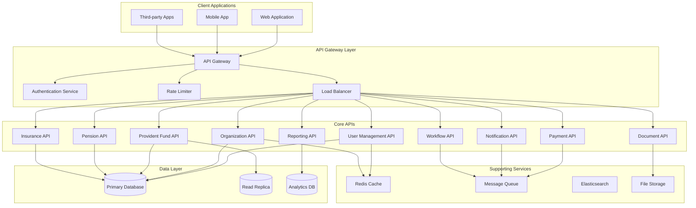

# Technical Specifications and API Design

## API Architecture Overview



## API Design Standards

### 1. RESTful API Guidelines

#### URL Structure and Naming Conventions
```yaml
URL_Structure:
  base_url: "https://api.epfindia.gov.in"
  versioning: "/v1"
  resource_naming: "plural_nouns"
  
  examples:
    - "/v1/users"
    - "/v1/organizations"
    - "/v1/pf-accounts"
    - "/v1/pension-accounts"
    - "/v1/transactions"
    - "/v1/documents"
    - "/v1/notifications"

HTTP_Methods:
  GET: "Retrieve resources"
  POST: "Create new resources"
  PUT: "Update entire resource"
  PATCH: "Partial resource update"
  DELETE: "Remove resources"
  HEAD: "Get resource metadata"
  OPTIONS: "Get allowed methods"

Status_Codes:
  success:
    - 200: "OK - Request successful"
    - 201: "Created - Resource created"
    - 202: "Accepted - Request accepted for processing"
    - 204: "No Content - Successful with no response body"
  
  client_errors:
    - 400: "Bad Request - Invalid request format"
    - 401: "Unauthorized - Authentication required"
    - 403: "Forbidden - Access denied"
    - 404: "Not Found - Resource not found"
    - 409: "Conflict - Resource conflict"
    - 422: "Unprocessable Entity - Validation errors"
    - 429: "Too Many Requests - Rate limit exceeded"
  
  server_errors:
    - 500: "Internal Server Error - Server error"
    - 502: "Bad Gateway - Upstream server error"
    - 503: "Service Unavailable - Service temporarily unavailable"
    - 504: "Gateway Timeout - Upstream server timeout"
```

#### Request/Response Format
```yaml
Request_Format:
  content_type: "application/json"
  charset: "UTF-8"
  headers:
    - "Authorization: Bearer {jwt_token}"
    - "Content-Type: application/json"
    - "Accept: application/json"
    - "X-Tenant-ID: {organization_id}"
    - "X-Request-ID: {unique_request_id}"
    - "X-API-Version: v1"

Response_Format:
  success_response:
    structure:
      status: "success"
      data: "Response data object/array"
      metadata:
        timestamp: "ISO 8601 timestamp"
        request_id: "Unique request identifier"
        pagination: "Pagination info (if applicable)"
        version: "API version"
  
  error_response:
    structure:
      status: "error"
      error:
        code: "Error code"
        message: "Human-readable error message"
        details: "Detailed error information"
        field_errors: "Field-specific validation errors"
      metadata:
        timestamp: "ISO 8601 timestamp"
        request_id: "Unique request identifier"
        version: "API version"
```

### 2. Authentication and Authorization

#### JWT Token Structure
```yaml
JWT_Configuration:
  algorithm: "RS256"
  issuer: "https://auth.epfindia.gov.in"
  audience: "https://api.epfindia.gov.in"
  expiration: 3600  # 1 hour
  
  token_structure:
    header:
      alg: "RS256"
      typ: "JWT"
      kid: "key_id"
    
    payload:
      iss: "Token issuer"
      sub: "User ID"
      aud: "API audience"
      exp: "Expiration timestamp"
      iat: "Issued at timestamp"
      jti: "JWT ID"
      tenant_id: "Organization ID"
      roles: ["role1", "role2"]
      permissions: ["permission1", "permission2"]
      session_id: "Session identifier"
    
    signature: "RSA signature"

OAuth2_Flows:
  authorization_code:
    use_case: "Web applications"
    redirect_uri: "Required"
    pkce: "Required for security"
  
  client_credentials:
    use_case: "Server-to-server"
    client_authentication: "Required"
    scope: "Limited permissions"
  
  refresh_token:
    use_case: "Token renewal"
    rotation: "Enabled"
    expiration: 2592000  # 30 days
```

## Core API Specifications

### 1. User Management API

#### User Registration and Authentication
```yaml
POST /v1/auth/register:
  description: "Register new user"
  request_body:
    uan_number: "string (12 digits)"
    mobile_number: "string (+91XXXXXXXXXX)"
    email: "string (email format)"
    password: "string (min 8 chars)"
    organization_id: "string (UUID)"
    employee_id: "string"
    consent: "boolean (required: true)"
  
  response:
    success:
      status: "success"
      data:
        user_id: "UUID"
        uan_number: "string"
        verification_required: "boolean"
        next_steps: "array of strings"
    
    error:
      status: "error"
      error:
        code: "VALIDATION_ERROR"
        message: "Invalid input data"
        field_errors:
          uan_number: ["Invalid UAN format"]
          mobile_number: ["Mobile number already registered"]

POST /v1/auth/login:
  description: "User authentication"
  request_body:
    username: "string (UAN/email/mobile)"
    password: "string"
    mfa_token: "string (optional)"
    device_info: "object"
  
  response:
    success:
      status: "success"
      data:
        access_token: "JWT token"
        refresh_token: "Refresh token"
        expires_in: 3600
        token_type: "Bearer"
        user_profile: "User object"
        mfa_required: "boolean"
    
    error:
      status: "error"
      error:
        code: "AUTHENTICATION_FAILED"
        message: "Invalid credentials"

GET /v1/users/profile:
  description: "Get user profile"
  authentication: "Required"
  response:
    success:
      status: "success"
      data:
        user_id: "UUID"
        uan_number: "string"
        personal_info:
          first_name: "string"
          last_name: "string"
          date_of_birth: "date"
          gender: "enum"
          mobile_number: "string"
          email: "string"
        employment_info:
          organization_id: "UUID"
          employee_id: "string"
          designation: "string"
          department: "string"
          join_date: "date"
        kyc_status:
          aadhaar_verified: "boolean"
          pan_verified: "boolean"
          bank_verified: "boolean"
          overall_status: "enum"
```

### 2. Provident Fund API

#### PF Account Management
```yaml
GET /v1/pf-accounts/{uan_number}:
  description: "Get PF account details"
  authentication: "Required"
  authorization: "User can access own account or authorized personnel"
  
  response:
    success:
      status: "success"
      data:
        account_info:
          uan_number: "string"
          pf_number: "string"
          member_id: "string"
          establishment_name: "string"
          establishment_code: "string"
        
        balance_info:
          employee_contribution: "decimal"
          employer_contribution: "decimal"
          pension_contribution: "decimal"
          total_balance: "decimal"
          last_contribution_date: "date"
        
        service_details:
          date_of_joining: "date"
          date_of_exit: "date (nullable)"
          total_service_years: "integer"
          total_service_months: "integer"
        
        nomination_details:
          nominees: "array of nominee objects"
          last_updated: "date"

GET /v1/pf-accounts/{uan_number}/contributions:
  description: "Get contribution history"
  authentication: "Required"
  query_parameters:
    from_date: "date (optional)"
    to_date: "date (optional)"
    page: "integer (default: 1)"
    limit: "integer (default: 20, max: 100)"
  
  response:
    success:
      status: "success"
      data:
        contributions: "array of contribution objects"
        summary:
          total_contributions: "decimal"
          total_months: "integer"
          average_monthly: "decimal"
      metadata:
        pagination:
          current_page: 1
          total_pages: 10
          total_records: 200
          has_next: true
          has_previous: false

POST /v1/pf-accounts/{uan_number}/withdrawals:
  description: "Apply for PF withdrawal"
  authentication: "Required"
  request_body:
    withdrawal_type: "enum (partial, full, advance)"
    withdrawal_reason: "enum"
    requested_amount: "decimal"
    bank_details:
      account_number: "string"
      ifsc_code: "string"
      bank_name: "string"
    documents: "array of document IDs"
    declaration: "boolean"
  
  response:
    success:
      status: "success"
      data:
        application_id: "UUID"
        application_number: "string"
        status: "submitted"
        estimated_processing_time: "string"
        next_steps: "array of strings"
```

### 3. Organization API

#### Organization Management
```yaml
POST /v1/organizations:
  description: "Register new organization"
  authentication: "Required"
  authorization: "System admin or authorized registrar"
  
  request_body:
    organization_info:
      name: "string"
      type: "enum (private, government, psu)"
      registration_number: "string"
      pan_number: "string"
      tan_number: "string"
      gstin: "string (optional)"
    
    address:
      street: "string"
      city: "string"
      state: "string"
      pincode: "string"
      country: "string (default: India)"
    
    contact_info:
      phone: "string"
      email: "string"
      website: "string (optional)"
    
    admin_user:
      name: "string"
      email: "string"
      mobile: "string"
      designation: "string"
  
  response:
    success:
      status: "success"
      data:
        organization_id: "UUID"
        establishment_code: "string"
        registration_status: "pending_verification"
        admin_credentials: "object"

GET /v1/organizations/{org_id}/employees:
  description: "Get organization employees"
  authentication: "Required"
  authorization: "HR manager or organization admin"
  query_parameters:
    status: "enum (active, inactive, all)"
    department: "string (optional)"
    search: "string (optional)"
    page: "integer"
    limit: "integer"
  
  response:
    success:
      status: "success"
      data:
        employees: "array of employee objects"
        summary:
          total_employees: "integer"
          active_employees: "integer"
          inactive_employees: "integer"

POST /v1/organizations/{org_id}/employees/bulk:
  description: "Bulk employee enrollment"
  authentication: "Required"
  authorization: "HR manager or organization admin"
  content_type: "multipart/form-data"
  
  request_body:
    file: "Excel/CSV file"
    validate_only: "boolean (default: false)"
  
  response:
    success:
      status: "success"
      data:
        job_id: "UUID"
        total_records: "integer"
        validation_results:
          valid_records: "integer"
          invalid_records: "integer"
          errors: "array of error objects"
        processing_status: "enum (validating, processing, completed)"
```

### 4. Payment API

#### Payment Processing
```yaml
POST /v1/payments/contributions:
  description: "Process contribution payment"
  authentication: "Required"
  authorization: "Organization admin or finance manager"
  
  request_body:
    organization_id: "UUID"
    payment_month: "string (YYYY-MM)"
    contributions: "array of contribution objects"
    payment_method: "enum (neft, rtgs, upi, cheque)"
    payment_reference: "string"
    total_amount: "decimal"
  
  response:
    success:
      status: "success"
      data:
        payment_id: "UUID"
        challan_number: "string"
        payment_status: "pending"
        payment_gateway_url: "string (if online payment)"

GET /v1/payments/{payment_id}/status:
  description: "Get payment status"
  authentication: "Required"
  
  response:
    success:
      status: "success"
      data:
        payment_id: "UUID"
        status: "enum (pending, processing, completed, failed)"
        amount: "decimal"
        payment_date: "date"
        transaction_reference: "string"
        failure_reason: "string (if failed)"

POST /v1/payments/withdrawals/{application_id}/process:
  description: "Process withdrawal payment"
  authentication: "Required"
  authorization: "EPFO officer"
  
  request_body:
    approved_amount: "decimal"
    processing_remarks: "string"
    payment_method: "enum (neft, rtgs, cheque)"
  
  response:
    success:
      status: "success"
      data:
        payment_id: "UUID"
        estimated_credit_date: "date"
        payment_reference: "string"
```

### 5. Document API

#### Document Management
```yaml
POST /v1/documents:
  description: "Upload document"
  authentication: "Required"
  content_type: "multipart/form-data"
  
  request_body:
    file: "File (PDF, JPG, PNG)"
    document_type: "enum"
    related_entity_type: "enum (user, application, organization)"
    related_entity_id: "UUID"
    description: "string (optional)"
  
  response:
    success:
      status: "success"
      data:
        document_id: "UUID"
        file_name: "string"
        file_size: "integer"
        document_type: "string"
        upload_status: "uploaded"
        verification_status: "pending"

GET /v1/documents/{document_id}:
  description: "Get document details"
  authentication: "Required"
  authorization: "Document owner or authorized personnel"
  
  response:
    success:
      status: "success"
      data:
        document_id: "UUID"
        file_name: "string"
        document_type: "string"
        file_size: "integer"
        upload_date: "date"
        verification_status: "enum"
        download_url: "string (signed URL)"
        expiry_date: "date (for signed URL)"

POST /v1/documents/{document_id}/verify:
  description: "Verify document"
  authentication: "Required"
  authorization: "EPFO officer or authorized verifier"
  
  request_body:
    verification_status: "enum (approved, rejected)"
    remarks: "string"
    extracted_data: "object (optional)"
  
  response:
    success:
      status: "success"
      data:
        verification_id: "UUID"
        status: "enum"
        verified_by: "string"
        verification_date: "date"
```

### 6. Notification API

#### Notification Management
```yaml
POST /v1/notifications:
  description: "Send notification"
  authentication: "Required"
  authorization: "System or authorized service"
  
  request_body:
    recipient_type: "enum (user, organization, broadcast)"
    recipients: "array of recipient IDs"
    notification_type: "string"
    channels: "array of channel names"
    priority: "enum (low, medium, high, critical)"
    content:
      subject: "string"
      message: "string"
      template_id: "string (optional)"
      variables: "object (optional)"
    schedule:
      send_immediately: "boolean"
      scheduled_time: "datetime (optional)"
  
  response:
    success:
      status: "success"
      data:
        notification_id: "UUID"
        batch_id: "UUID"
        total_recipients: "integer"
        estimated_delivery_time: "string"

GET /v1/notifications/{notification_id}/status:
  description: "Get notification delivery status"
  authentication: "Required"
  
  response:
    success:
      status: "success"
      data:
        notification_id: "UUID"
        overall_status: "enum"
        delivery_summary:
          total_sent: "integer"
          delivered: "integer"
          failed: "integer"
          pending: "integer"
        channel_breakdown: "object"
        delivery_details: "array of delivery objects"

GET /v1/users/{user_id}/notifications:
  description: "Get user notifications"
  authentication: "Required"
  authorization: "User can access own notifications"
  query_parameters:
    status: "enum (read, unread, all)"
    type: "string (optional)"
    page: "integer"
    limit: "integer"
  
  response:
    success:
      status: "success"
      data:
        notifications: "array of notification objects"
        unread_count: "integer"
      metadata:
        pagination: "pagination object"
```

## API Security Specifications

### 1. Rate Limiting

#### Rate Limiting Configuration
```yaml
Rate_Limiting:
  global_limits:
    requests_per_minute: 1000
    requests_per_hour: 10000
    requests_per_day: 100000
  
  endpoint_specific_limits:
    authentication:
      requests_per_minute: 10
      requests_per_hour: 100
      burst_limit: 5
    
    file_upload:
      requests_per_minute: 20
      requests_per_hour: 200
      file_size_limit: "10MB"
    
    bulk_operations:
      requests_per_minute: 5
      requests_per_hour: 50
      concurrent_limit: 2
  
  user_tier_limits:
    basic_user:
      requests_per_minute: 60
      requests_per_hour: 1000
    
    premium_user:
      requests_per_minute: 120
      requests_per_hour: 2000
    
    organization_admin:
      requests_per_minute: 300
      requests_per_hour: 5000
  
  rate_limit_headers:
    - "X-RateLimit-Limit: 1000"
    - "X-RateLimit-Remaining: 999"
    - "X-RateLimit-Reset: 1640995200"
    - "X-RateLimit-Retry-After: 60"
```

### 2. Input Validation

#### Validation Rules
```yaml
Input_Validation:
  common_validations:
    uan_number:
      pattern: "^[0-9]{12}$"
      required: true
      description: "12-digit UAN number"
    
    mobile_number:
      pattern: "^\\+91[6-9][0-9]{9}$"
      required: true
      description: "Indian mobile number with +91 prefix"
    
    email:
      pattern: "^[a-zA-Z0-9._%+-]+@[a-zA-Z0-9.-]+\\.[a-zA-Z]{2,}$"
      required: true
      max_length: 255
    
    pan_number:
      pattern: "^[A-Z]{5}[0-9]{4}[A-Z]{1}$"
      required: true
      description: "10-character PAN number"
    
    amount:
      type: "decimal"
      minimum: 0
      maximum: 10000000
      decimal_places: 2
  
  sanitization:
    - html_escape: "Escape HTML characters"
    - sql_injection_prevention: "Parameterized queries"
    - xss_prevention: "Content Security Policy"
    - file_type_validation: "Whitelist allowed file types"
  
  error_responses:
    validation_error:
      status: "error"
      error:
        code: "VALIDATION_ERROR"
        message: "Input validation failed"
        field_errors:
          field_name: ["Error message 1", "Error message 2"]
```

### 3. API Monitoring and Logging

#### Monitoring Configuration
```yaml
API_Monitoring:
  metrics:
    - request_count: "Total API requests"
    - response_time: "Average response time"
    - error_rate: "Percentage of failed requests"
    - throughput: "Requests per second"
    - concurrent_users: "Active user sessions"
  
  logging:
    log_level: "INFO"
    log_format: "JSON"
    log_fields:
      - timestamp: "ISO 8601 format"
      - request_id: "Unique identifier"
      - user_id: "Authenticated user ID"
      - tenant_id: "Organization ID"
      - method: "HTTP method"
      - endpoint: "API endpoint"
      - status_code: "HTTP status code"
      - response_time: "Response time in ms"
      - user_agent: "Client user agent"
      - ip_address: "Client IP address"
  
  alerting:
    high_error_rate:
      threshold: "5%"
      duration: "5 minutes"
      action: "Send alert to operations team"
    
    slow_response:
      threshold: "2 seconds"
      duration: "5 minutes"
      action: "Send performance alert"
    
    high_traffic:
      threshold: "1000 requests/minute"
      action: "Scale up infrastructure"
```

## API Documentation Standards

### 1. OpenAPI Specification

#### OpenAPI Configuration
```yaml
OpenAPI_Spec:
  openapi: "3.0.3"
  info:
    title: "EPFO Portal API"
    description: "Comprehensive API for EPFO portal services"
    version: "1.0.0"
    contact:
      name: "EPFO API Support"
      email: "api-support@epfindia.gov.in"
      url: "https://developer.epfindia.gov.in"
    license:
      name: "Government of India License"
      url: "https://www.epfindia.gov.in/license"
  
  servers:
    - url: "https://api.epfindia.gov.in/v1"
      description: "Production server"
    - url: "https://api-staging.epfindia.gov.in/v1"
      description: "Staging server"
    - url: "https://api-dev.epfindia.gov.in/v1"
      description: "Development server"
  
  security:
    - BearerAuth: []
    - OAuth2: ["read", "write"]
  
  components:
    securitySchemes:
      BearerAuth:
        type: "http"
        scheme: "bearer"
        bearerFormat: "JWT"
      OAuth2:
        type: "oauth2"
        flows:
          authorizationCode:
            authorizationUrl: "https://auth.epfindia.gov.in/oauth/authorize"
            tokenUrl: "https://auth.epfindia.gov.in/oauth/token"
            scopes:
              read: "Read access"
              write: "Write access"
```

### 2. API Testing Strategy

#### Testing Framework
```yaml
API_Testing:
  unit_tests:
    framework: "Jest/Mocha"
    coverage_threshold: 90
    test_types:
      - input_validation
      - business_logic
      - error_handling
      - security_checks
  
  integration_tests:
    framework: "Postman/Newman"
    test_scenarios:
      - end_to_end_workflows
      - third_party_integrations
      - database_interactions
      - external_service_calls
  
  performance_tests:
    framework: "JMeter/K6"
    test_scenarios:
      - load_testing: "Normal expected load"
      - stress_testing: "Peak load conditions"
      - spike_testing: "Sudden traffic spikes"
      - volume_testing: "Large data volumes"
  
  security_tests:
    framework: "OWASP ZAP"
    test_scenarios:
      - authentication_bypass
      - authorization_flaws
      - input_validation_bypass
      - sql_injection
      - xss_attacks
      - csrf_attacks
  
  automated_testing:
    ci_cd_integration: true
    test_execution: "On every commit"
    test_reporting: "Detailed test reports"
    failure_notifications: "Immediate alerts"
```

This comprehensive technical specification and API design provides a solid foundation for implementing a robust, secure, and scalable EPFO portal system.