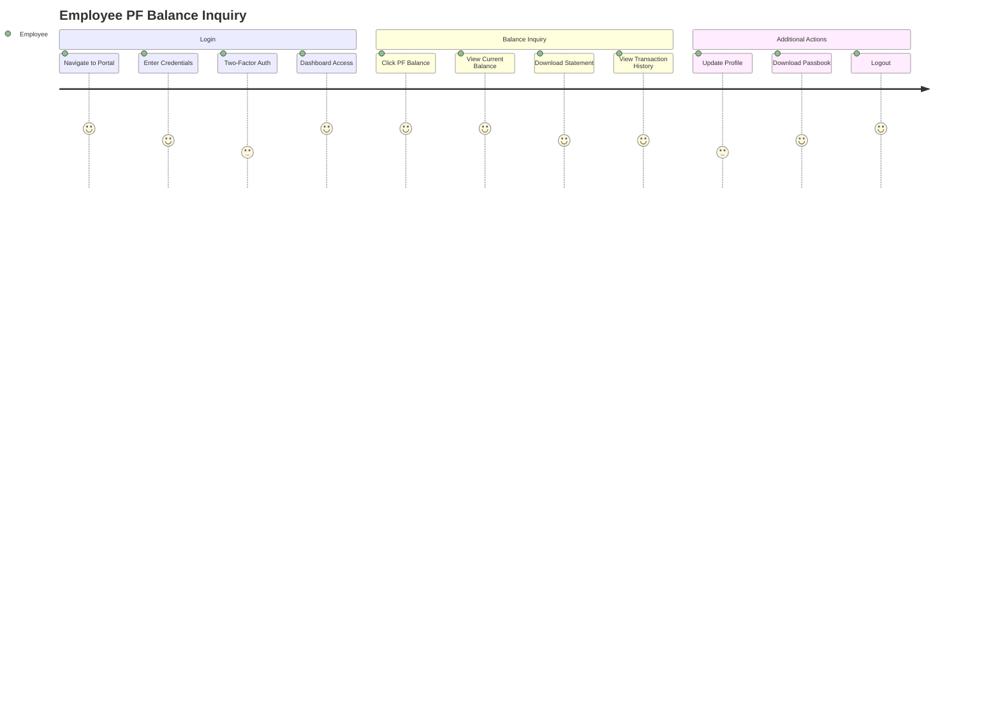
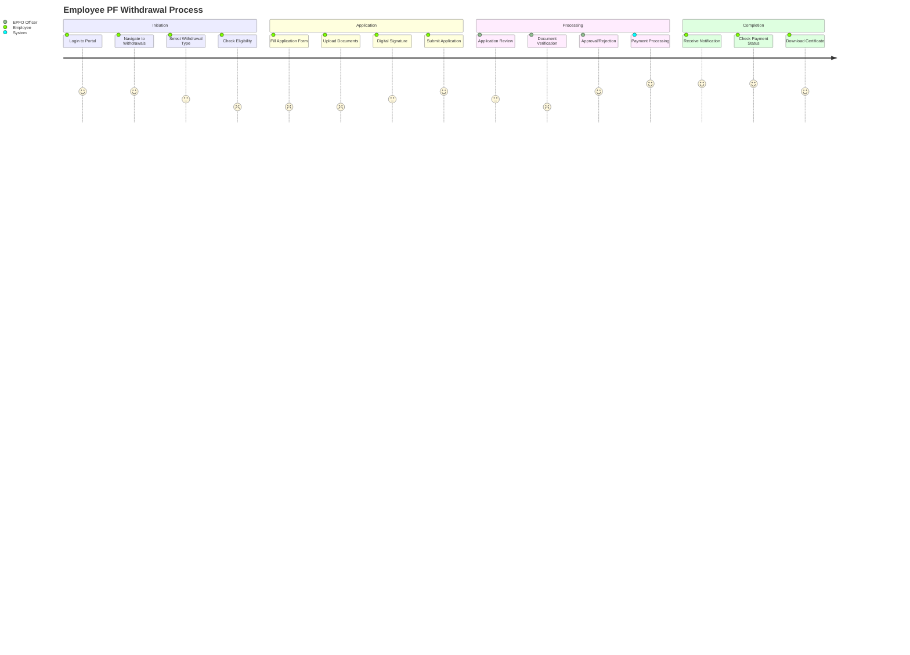
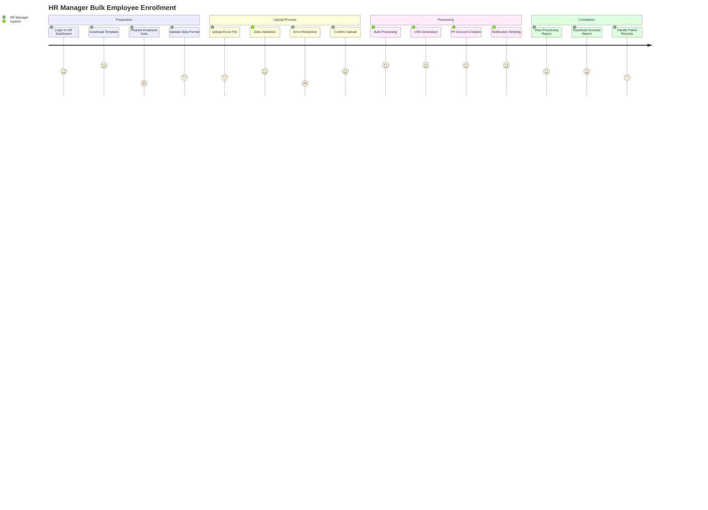
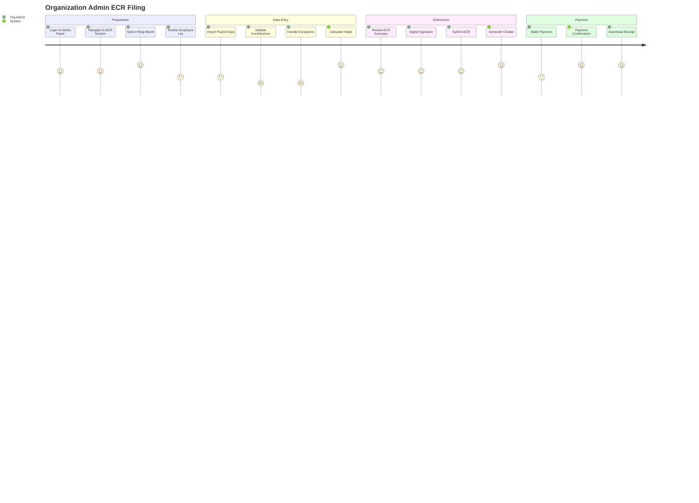

# User Journey Maps and Wireframes

## Key User Journeys

### 1. Employee PF Balance Inquiry Journey



**Pain Points Addressed**:
- Single sign-on across all services
- Real-time balance display
- Mobile-responsive design
- Quick access to statements

### 2. Employee PF Withdrawal Journey



**Improvements**:
- Automated eligibility checking
- Real-time status tracking
- Digital document upload
- Automated notifications

### 3. HR Manager Bulk Employee Enrollment Journey



**Key Features**:
- Excel template with validation
- Real-time processing status
- Error handling and reporting
- Automated UAN generation

### 4. Organization Admin ECR Filing Journey



**Enhancements**:
- Payroll system integration
- Automated calculations
- Digital signature support
- Integrated payment gateway

## Wireframes for Key Screens

### 1. Employee Dashboard Wireframe

```
┌─────────────────────────────────────────────────────────────┐
│ EPFO Portal                    [Profile] [Notifications] [⚙] │
├─────────────────────────────────────────────────────────────┤
│ Welcome, John Doe                                           │
│ UAN: 123456789012                                          │
├─────────────────────────────────────────────────────────────┤
│                                                             │
│ ┌─────────────────┐ ┌─────────────────┐ ┌─────────────────┐ │
│ │   PF Balance    │ │   Last Contrib  │ │   Pension Info  │ │
│ │   ₹2,45,678     │ │   ₹3,500        │ │   ₹1,250/month  │ │
│ │   [View Details]│ │   [View History]│ │   [View Details]│ │
│ └─────────────────┘ └─────────────────┘ └─────────────────┘ │
│                                                             │
│ ┌─────────────────────────────────────────────────────────┐ │
│ │                Quick Actions                            │ │
│ │ [Apply for Withdrawal] [Transfer PF] [Update Profile]   │ │
│ │ [Download Passbook] [Raise Grievance] [Track Claims]   │ │
│ └─────────────────────────────────────────────────────────┘ │
│                                                             │
│ ┌─────────────────────────────────────────────────────────┐ │
│ │                Recent Activities                        │ │
│ │ • PF Contribution for March 2024 - ₹3,500             │ │
│ │ • Profile updated on 15/03/2024                       │ │
│ │ • Withdrawal application approved - ₹50,000           │ │
│ └─────────────────────────────────────────────────────────┘ │
│                                                             │
│ ┌─────────────────────────────────────────────────────────┐ │
│ │                   Announcements                         │ │
│ │ • New interest rate: 8.25% for FY 2024-25             │ │
│ │ • Online services will be unavailable on 20/03/2024   │ │
│ └─────────────────────────────────────────────────────────┘ │
└─────────────────────────────────────────────────────────────┘
```

### 2. HR Manager Dashboard Wireframe

```
┌─────────────────────────────────────────────────────────────┐
│ EPFO Portal - HR Dashboard        [Profile] [Help] [Logout] │
├─────────────────────────────────────────────────────────────┤
│ ABC Corporation Ltd.                                        │
│ Establishment Code: DL/12345                               │
├─────────────────────────────────────────────────────────────┤
│                                                             │
│ ┌─────────────────┐ ┌─────────────────┐ ┌─────────────────┐ │
│ │ Total Employees │ │ Active Members  │ │ Monthly Contrib │ │
│ │      1,250      │ │      1,180      │ │   ₹12,45,000   │ │
│ │   [View List]   │ │   [View List]   │ │  [View Details] │ │
│ └─────────────────┘ └─────────────────┘ └─────────────────┘ │
│                                                             │
│ ┌─────────────────────────────────────────────────────────┐ │
│ │                  Quick Actions                          │ │
│ │ [Add Employee] [Bulk Upload] [Generate ECR] [Reports]   │ │
│ │ [Update Salary] [Exit Employee] [Download Forms]       │ │
│ └─────────────────────────────────────────────────────────┘ │
│                                                             │
│ ┌─────────────────────────────────────────────────────────┐ │
│ │                Pending Tasks                            │ │
│ │ • 15 employees pending UAN activation                   │ │
│ │ • March 2024 ECR filing due in 3 days                 │ │
│ │ • 5 withdrawal applications need approval              │ │
│ │ • Salary revision for 25 employees pending            │ │
│ └─────────────────────────────────────────────────────────┘ │
│                                                             │
│ ┌─────────────────────────────────────────────────────────┐ │
│ │                Recent Activities                        │ │
│ │ • ECR filed for February 2024 - ₹11,80,000            │ │
│ │ • 10 new employees enrolled                            │ │
│ │ • Bulk salary update completed for IT department      │ │
│ └─────────────────────────────────────────────────────────┘ │
└─────────────────────────────────────────────────────────────┘
```

### 3. PF Withdrawal Application Form Wireframe

```
┌─────────────────────────────────────────────────────────────┐
│ PF Withdrawal Application                          [Help] [×]│
├─────────────────────────────────────────────────────────────┤
│                                                             │
│ Step 1 of 4: Basic Information                             │
│ ████████████████████████████████████████████████████████    │
│                                                             │
│ ┌─────────────────────────────────────────────────────────┐ │
│ │ Withdrawal Type: [Partial ▼]                           │ │
│ │                                                         │ │
│ │ Reason for Withdrawal: [Medical Emergency ▼]           │ │
│ │                                                         │ │
│ │ Current PF Balance: ₹2,45,678                          │ │
│ │ Maximum Withdrawal: ₹1,22,839 (50%)                    │ │
│ │                                                         │ │
│ │ Requested Amount: [₹50,000        ]                    │ │
│ │                                                         │ │
│ │ ┌─────────────────────────────────────────────────────┐ │ │
│ │ │ ✓ Eligibility Check Passed                         │ │ │
│ │ │ • Minimum 5 years of service completed             │ │ │
│ │ │ • No pending dues                                  │ │ │
│ │ │ • Valid reason for withdrawal                      │ │ │
│ │ └─────────────────────────────────────────────────────┘ │ │
│ └─────────────────────────────────────────────────────────┘ │
│                                                             │
│ Bank Details (Auto-filled from profile)                    │
│ ┌─────────────────────────────────────────────────────────┐ │
│ │ Bank Name: State Bank of India                          │ │
│ │ Account Number: ****1234                               │ │
│ │ IFSC Code: SBIN0001234                                 │ │
│ │ [Update Bank Details]                                  │ │
│ └─────────────────────────────────────────────────────────┘ │
│                                                             │
│                              [Cancel] [Save & Continue →] │
└─────────────────────────────────────────────────────────────┘
```

### 4. Organization Admin ECR Filing Screen Wireframe

```
┌─────────────────────────────────────────────────────────────┐
│ ECR Filing - March 2024                    [Save] [Submit] │
├─────────────────────────────────────────────────────────────┤
│                                                             │
│ Establishment: ABC Corporation Ltd. (DL/12345)             │
│ Filing Period: March 2024                                  │
│ Due Date: 15th April 2024 (5 days remaining)              │
│                                                             │
│ ┌─────────────────────────────────────────────────────────┐ │
│ │                    Summary                              │ │
│ │ Total Employees: 1,180                                  │ │
│ │ Total Wages: ₹1,25,00,000                              │ │
│ │ Employee Contribution: ₹6,25,000                       │ │
│ │ Employer Contribution: ₹6,25,000                       │ │
│ │ Pension Contribution: ₹1,04,167                        │ │
│ │ Admin Charges: ₹5,900                                  │ │
│ │ EDLI Charges: ₹590                                     │ │
│ │ Total Amount: ₹13,60,657                               │ │
│ └─────────────────────────────────────────────────────────┘ │
│                                                             │
│ ┌─────────────────────────────────────────────────────────┐ │
│ │ Employee Details                        [Import] [Export]│ │
│ │ ┌─────┬──────────┬─────────┬──────────┬──────────┬─────┐ │ │
│ │ │ UAN │   Name   │  Wages  │ EE Cont. │ ER Cont. │ ... │ │ │
│ │ ├─────┼──────────┼─────────┼──────────┼──────────┼─────┤ │ │
│ │ │123..│John Doe  │ 50,000  │  6,000   │  6,000   │ ... │ │ │
│ │ │456..│Jane Smith│ 45,000  │  5,400   │  5,400   │ ... │ │ │
│ │ │789..│Bob Wilson│ 55,000  │  6,600   │  6,600   │ ... │ │ │
│ │ │ ... │   ...    │   ...   │   ...    │   ...    │ ... │ │ │
│ │ └─────┴──────────┴─────────┴──────────┴──────────┴─────┘ │ │
│ │                                          [View All 1180] │ │
│ └─────────────────────────────────────────────────────────┘ │
│                                                             │
│ ┌─────────────────────────────────────────────────────────┐ │
│ │ Validation Results                                      │ │
│ │ ✓ All employee data validated                          │ │
│ │ ✓ Contribution calculations verified                   │ │
│ │ ⚠ 3 employees with wage ceiling exceeded              │ │
│ │ [View Details]                                         │ │
│ └─────────────────────────────────────────────────────────┘ │
│                                                             │
│ [Generate Challan] [Preview ECR] [Digital Sign & Submit]   │
└─────────────────────────────────────────────────────────────┘
```

### 5. Mobile App Dashboard Wireframe

```
┌─────────────────────┐
│ ☰ EPFO    🔔 👤    │
├─────────────────────┤
│                     │
│ Hi, John Doe        │
│ UAN: 123456789012   │
│                     │
│ ┌─────────────────┐ │
│ │   PF Balance    │ │
│ │   ₹2,45,678     │ │
│ │                 │ │
│ │ Last Updated:   │ │
│ │ 15 Mar 2024     │ │
│ └─────────────────┘ │
│                     │
│ ┌─────────────────┐ │
│ │ Quick Actions   │ │
│ │                 │ │
│ │ 📊 View Balance │ │
│ │ 📄 Passbook     │ │
│ │ 💰 Withdraw     │ │
│ │ 🔄 Transfer     │ │
│ │ 👤 Profile      │ │
│ │ 📞 Support      │ │
│ └─────────────────┘ │
│                     │
│ Recent Activity     │
│ ┌─────────────────┐ │
│ │ • Contribution  │ │
│ │   Mar 2024      │ │
│ │   ₹3,500        │ │
│ │                 │ │
│ │ • Profile       │ │
│ │   Updated       │ │
│ │   15/03/2024    │ │
│ └─────────────────┘ │
│                     │
│ [View All Activity] │
└─────────────────────┘
```

## User Experience Improvements

### 1. Progressive Web App Features
- **Offline Capability**: Cache critical data for offline viewing
- **Push Notifications**: Real-time updates on application status
- **App-like Experience**: Native app feel on mobile devices
- **Quick Actions**: Shortcuts for frequently used features

### 2. Accessibility Features
- **Screen Reader Support**: ARIA labels and semantic HTML
- **Keyboard Navigation**: Full keyboard accessibility
- **High Contrast Mode**: Better visibility for visually impaired
- **Multi-language Support**: Regional language options

### 3. Smart Features
- **Auto-fill**: Pre-populate forms with known data
- **Smart Suggestions**: Contextual help and suggestions
- **Predictive Search**: Quick search across all features
- **Voice Commands**: Voice-enabled navigation (mobile)

### 4. Personalization
- **Custom Dashboard**: User-configurable dashboard widgets
- **Favorite Actions**: Quick access to frequently used features
- **Notification Preferences**: Customizable notification settings
- **Theme Options**: Light/dark mode and color preferences

## Workflow Optimizations

### 1. Automated Workflows
- **Auto-approval**: For routine transactions below threshold
- **Smart Routing**: Route applications to appropriate officers
- **Escalation Management**: Automatic escalation for delayed approvals
- **Bulk Processing**: Batch processing for similar applications

### 2. Real-time Features
- **Live Status Updates**: Real-time application tracking
- **Instant Notifications**: Immediate alerts for important events
- **Live Chat Support**: Real-time customer support
- **Dynamic Forms**: Forms that adapt based on user input

### 3. Integration Workflows
- **Payroll Integration**: Direct import from payroll systems
- **Bank Integration**: Real-time payment status updates
- **Document Verification**: Automated document validation
- **Third-party APIs**: Integration with government databases

### 4. Analytics and Insights
- **Usage Analytics**: Track user behavior and preferences
- **Performance Metrics**: Monitor system performance
- **Predictive Analytics**: Forecast trends and issues
- **Custom Reports**: User-defined reporting capabilities